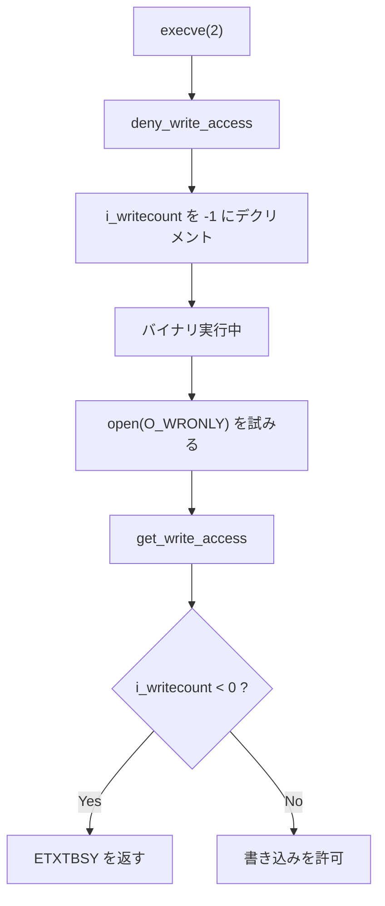

# open(2) や execve(2) で ETXTBSY を返すケース

> 🤖 Originally written by hand, revised with AI assistance.

ETXTBSY を返すケースをまとめます。なお macOS だと挙動が全然違います。

## ETXTBSY を返すケース

### 実行中のバイナリを O_WRONLY つけて open(2) しようとすると返す

.sleep バイナリが他のプロセスによって実行中。この時 cp で上書きを試みると ETXTBSY を返します。

```console
$ strace cp /dev/null .sleep

open(".sleep", O_WRONLY|O_TRUNC)        = -1 ETXTBSY (Text file busy)
```

最初の予想と違って O_TRUNC 有無は関係ない。あと権限も関係ない。

```console
$ strace ./.open
open(".sleep", O_WRONLY)                = -1 ETXTBSY (Text file busy)
```

`cp --remove-destination` にすると unlink(2) してから open(2) するので ETXTBSY は返さない。

```console
$ strace cp --remove-destination /dev/null ./.sleep

// ...

stat("./.sleep", {st_mode=S_IFREG|0755, st_size=6532, ...}) = 0
stat("/dev/null", {st_mode=S_IFCHR|0666, st_rdev=makedev(1, 3), ...}) = 0
lstat("./.sleep", {st_mode=S_IFREG|0755, st_size=6532, ...}) = 0
unlink("./.sleep")                      = 0
open("/dev/null", O_RDONLY)             = 3
fstat(3, {st_mode=S_IFCHR|0666, st_rdev=makedev(1, 3), ...}) = 0
open("./.sleep", O_WRONLY|O_CREAT|O_EXCL, 0666) = 4
fstat(4, {st_mode=S_IFREG|0644, st_size=0, ...}) = 0
read(3, "", 32768)                      = 0
```

`cp -f` にすると ETXTBSY が返ってきてから unlink(2) して open -> write を試みます。

```console
stat(".sleep", {st_mode=S_IFREG|0755, st_size=6532, ...}) = 0
stat("/dev/null", {st_mode=S_IFCHR|0666, st_rdev=makedev(1, 3), ...}) = 0
stat(".sleep", {st_mode=S_IFREG|0755, st_size=6532, ...}) = 0
open("/dev/null", O_RDONLY)             = 3
fstat(3, {st_mode=S_IFCHR|0666, st_rdev=makedev(1, 3), ...}) = 0
open(".sleep", O_WRONLY|O_TRUNC)        = -1 ETXTBSY (Text file busy)
unlink(".sleep")                        = 0
open(".sleep", O_WRONLY|O_CREAT|O_EXCL, 0666) = 4
fstat(4, {st_mode=S_IFREG|0644, st_size=0, ...}) = 0
read(3, "", 32768)                      = 0
```

### O_WRONLY で open(2) 中のバイナリを execve(2) しようとすると返す

まずは .sleep バイナリを open + O_WRONLY している状態を作っておきます。

```c
	if (open(".sleep", O_WRONLY) == -1)
		perror("open");

	sleep(100);
```

他のシェルで .sleep バイナリを実行しようとすると execve(2) が ETXTBSY を返します。

```console
[vagrant@vagrant-centos65 vagrant]$ strace ./.sleep
execve("./.sleep", ["./.sleep"], [/* 22 vars */]) = -1 ETXTBSY (Text file busy)
dup(2)                                  = 3
fcntl(3, F_GETFL)                       = 0x8002 (flags O_RDWR|O_LARGEFILE)
fstat(3, {st_mode=S_IFCHR|0620, st_rdev=makedev(136, 0), ...}) = 0
mmap(NULL, 4096, PROT_READ|PROT_WRITE, MAP_PRIVATE|MAP_ANONYMOUS, -1, 0) = 0x7fdd7cb8e000
lseek(3, 0, SEEK_CUR)                   = -1 ESPIPE (Illegal seek)
write(3, "strace: exec: Text file busy\n", 29strace: exec: Text file busy
) = 29
close(3)                                = 0
munmap(0x7fdd7cb8e000, 4096)            = 0
exit_group(1)                           = ?
```

### 考察

 * バイナリを open(2)/write(2) で更新するのではなく、rename(2) で置き換えるのが正解です (rsync がこの方式を採用しています)。
 * `cp -f` もしくは `cp --remove-destination` では unlink(2) してからコピー (open, write) して ETXTBSY を回避できます。
   * 新しくバイナリを cp している間に、バイナリを execve(2) するプロセスがあると ETXTBSY でエラーになる問題があります。
   * rename(2) が atomic で安全な手法です。

## ETXTBSY を返すカーネル内のコード

汎用的なのは fs/namei.c の次の二つです。

 * get_write_access
   * file への write 権を得ます。
 * deny_write_access
   * file の write 権を解放します。

inode の i_writecount の取りうる値と状態:

 * 0   書き込みが無い、VM_DENYWRITE されていない
 * < 0 vm_area_structs に VM_DENYWRITE がセットされている
 * > 0 file に書き込み中

```c
/*
 * get_write_access() gets write permission for a file.
 * put_write_access() releases this write permission.
 * This is used for regular files.
 * We cannot support write (and maybe mmap read-write shared) accesses and
 * MAP_DENYWRITE mmappings simultaneously. The i_writecount field of an inode
 * can have the following values:
 * 0: no writers, no VM_DENYWRITE mappings
 * < 0: (-i_writecount) vm_area_structs with VM_DENYWRITE set exist
 * > 0: (i_writecount) users are writing to the file.
 *
 * Normally we operate on that counter with atomic_{inc,dec} and it's safe
 * except for the cases where we don't hold i_writecount yet. Then we need to
 * use {get,deny}_write_access() - these functions check the sign and refuse
 * to do the change if sign is wrong. Exclusion between them is provided by
 * the inode->i_lock spinlock.
 */

int get_write_access(struct inode * inode)
{
	spin_lock(&inode->i_lock);
	if (atomic_read(&inode->i_writecount) < 0) {
		spin_unlock(&inode->i_lock);
		return -ETXTBSY;
	}
	atomic_inc(&inode->i_writecount);
	spin_unlock(&inode->i_lock);

	return 0;
}

int deny_write_access(struct file * file)
{
	struct inode *inode = file->f_path.dentry->d_inode;

	spin_lock(&inode->i_lock);
    // 対象の file が write で開かれているなら ETXTBSY になる
	if (atomic_read(&inode->i_writecount) > 0) {
		spin_unlock(&inode->i_lock);
		return -ETXTBSY;
	}
	atomic_dec(&inode->i_writecount);
	spin_unlock(&inode->i_lock);

	return 0;
}
```

🤖 上記のコードは v3.0 以前のカーネルです。v3.1 以降で大幅に変更されています。

### 🤖 最新カーネル (v3.1〜v6.x) での get_write_access / deny_write_access

> 🤖 This section was generated by AI.

v3.1 で spinlock が除去され、`atomic_inc_unless_negative()` / `atomic_dec_unless_positive()` による lock-free な CAS 操作に変更されました。定義場所も `fs/namei.c` の外部関数から `include/linux/fs.h` の static inline 関数に移動しています。

```c
/* v3.1〜現在: include/linux/fs.h にインライン定義 */

static inline int get_write_access(struct inode *inode)
{
    return atomic_inc_unless_negative(&inode->i_writecount) ? 0 : -ETXTBSY;
}

static inline int deny_write_access(struct file *file)
{
    struct inode *inode = file_inode(file);
    return atomic_dec_unless_positive(&inode->i_writecount) ? 0 : -ETXTBSY;
}
```

| 項目 | 旧 (v2.6〜v3.0) | 新 (v3.1〜現在) |
|---|---|---|
| 定義場所 | `fs/namei.c` (外部関数) | `include/linux/fs.h` (static inline) |
| 排他制御 | `spin_lock(&inode->i_lock)` | lock-free (`atomic_inc_unless_negative`) |
| コード量 | 12 行 | 1 行 (ワンライナー) |
| パフォーマンス | spinlock の acquire/release コスト | CAS 命令 1 回で完了 |

`atomic_inc_unless_negative()` は「カウンターが負でない場合のみインクリメント」を 1 回の CAS (Compare-And-Swap) 命令で実行します。旧実装では `spin_lock` → `atomic_read` → 条件分岐 → `atomic_inc` → `spin_unlock` と 5 ステップ必要だったものが、1 ステップに削減されています。

`i_writecount` のセマンティクス (0 / 負 / 正 の意味) は変わっていません。

### get_write_access が使われているコード

 * do_filp_open + O_TRUNC で handle_truncate 呼び出すパス

```c
static int handle_truncate(struct file *filp)
{
	struct path *path = &filp->f_path;
	struct inode *inode = path->dentry->d_inode;
	int error = get_write_access(inode);
	if (error)
		return error;
	/*
	 * Refuse to truncate files with mandatory locks held on them.
	 */
	error = locks_verify_locked(inode);
	if (!error)
		error = security_path_truncate(path, 0,
				       ATTR_MTIME|ATTR_CTIME|ATTR_OPEN);
	if (!error) {
		error = do_truncate(path->dentry, 0,
				    ATTR_MTIME|ATTR_CTIME|ATTR_OPEN,
				    filp);
	}
	put_write_access(inode);
	return error;
}
```

 * do_filp_open
 * -> nameidata_to_filp
 * -> __dentry_open

```c
static struct file *__dentry_open(struct dentry *dentry, struct vfsmount *mnt,
					struct file *f,
					int (*open)(struct inode *, struct file *),
					const struct cred *cred)
{
	struct inode *inode;
	int error;

	f->f_mode = (__force fmode_t)((f->f_flags+1) & O_ACCMODE) | FMODE_LSEEK |
				FMODE_PREAD | FMODE_PWRITE;
	inode = dentry->d_inode;
	if (f->f_mode & FMODE_WRITE) {
                // ->
		error = __get_file_write_access(inode, mnt);
		if (error)
			goto cleanup_file;
		if (!special_file(inode->i_mode))
			file_take_write(f);
	}

/*
 * You have to be very careful that these write
 * counts get cleaned up in error cases and
 * upon __fput().  This should probably never
 * be called outside of __dentry_open().
 */
static inline int __get_file_write_access(struct inode *inode,
					  struct vfsmount *mnt)
{
	int error;
	error = get_write_access(inode);
	if (error)
		return error;
	/*
	 * Do not take mount writer counts on
	 * special files since no writes to
	 * the mount itself will occur.
	 */
	if (!special_file(inode->i_mode)) {
		/*
		 * Balanced in __fput()
		 */
		error = __mnt_want_write(mnt);
		if (error)
			put_write_access(inode);
	}
	return error;
}
```

🤖 `__dentry_open` は v3.5 で `do_dentry_open` に置き換えられ、v6.x では完全に除去されています。

### 🤖 最新カーネル (v6.x) での do_dentry_open

> 🤖 This section was generated by AI.

| バージョン | 関数名 | 備考 |
|---|---|---|
| v3.0〜v3.4 | `__dentry_open` | 上記のコードが引用しているバージョン |
| v3.5〜v4.x | `do_dentry_open` と `__dentry_open` が共存 | `do_dentry_open` がコア実装、`__dentry_open` はラッパー |
| v6.x (最新) | `do_dentry_open` のみ | `__dentry_open` は完全に除去済み |

シグネチャも大幅に簡素化されています。

```c
/* 旧 (v3.x) */
static struct file *__dentry_open(struct dentry *dentry, struct vfsmount *mnt,
    struct file *f,
    int (*open)(struct inode *, struct file *),
    const struct cred *cred)

/* 最新 (v6.x) */
static int do_dentry_open(struct file *f,
    int (*open)(struct inode *, struct file *))
```

- 戻り値が `struct file *` → `int` に変更されています。
- `dentry`, `mnt`, `cred` の個別引数がなくなり、`struct file *f` にすべて包含されています。
- write access の取得は `__get_file_write_access()` → `file_get_write_access()` に変更されています。

```c
/* 最新カーネル: fs/open.c */
if (f->f_mode & FMODE_WRITE && !special_file(inode->i_mode)) {
    error = file_get_write_access(f);  /* get_write_access + mnt_get_write_access */
    if (unlikely(error))
        goto cleanup_file;
    f->f_mode |= FMODE_WRITER;
}
```

## execve(2)

do_execve -> open_exec で deny_write_access

 * execve したいバイナリが O_WRONLY で open(2) されていたら ETXTBSY が返ります。

```c
struct file *open_exec(const char *name)
{
	struct file *file;
	int err;
	struct filename filename = { .name = name };

	file = do_filp_open(AT_FDCWD, &filename,
				O_LARGEFILE | O_RDONLY | FMODE_EXEC, 0,
				MAY_EXEC | MAY_OPEN);
	if (IS_ERR(file))
		goto out;

	err = -EACCES;
	if (!S_ISREG(file->f_path.dentry->d_inode->i_mode))
		goto exit;

	if (file->f_path.mnt->mnt_flags & MNT_NOEXEC)
		goto exit;

	fsnotify_open(file->f_path.dentry);

	err = deny_write_access(file);
	if (err)
		goto exit;
```

🤖 最新カーネル (v6.x) では呼び出しチェーンが変更されています。

### 🤖 最新カーネル (v6.x) での execve の呼び出しチェーン

> 🤖 This section was generated by AI.

**旧 (v2.6〜v3.x):**
```
execve → do_execve → open_exec → do_filp_open → deny_write_access
```

**最新 (v6.x):**
```
execve → do_execveat_common → alloc_bprm → do_open_execat → exe_file_deny_write_access → deny_write_access
```

`deny_write_access` を直接呼び出すのではなく、`exe_file_deny_write_access` というラッパー関数を経由するようになりました。HSM (Hierarchical Storage Management) の fsnotify イベントが有効な場合は、write denial をスキップする特殊処理が追加されています。

```c
static inline int exe_file_deny_write_access(struct file *exe_file)
{
    if (unlikely(FMODE_FSNOTIFY_HSM(exe_file->f_mode)))
        return 0;  /* HSM fsnotify が有効なら deny しない */
    return deny_write_access(exe_file);
}
```

## VM_DENYWRITE とは?

`VM_DENYWRITE` は、VMA (Virtual Memory Area) にセットされるフラグで、マッピングされたファイルへの書き込みを拒否するために使用されていました。実行中のバイナリのコードセグメントに `VM_DENYWRITE` をセットすることで、`i_writecount` を負の値にし、`get_write_access` が ETXTBSY を返す仕組みです。



🤖 v5.15 で David Hildenbrand (Red Hat) により `VM_DENYWRITE` / `MAP_DENYWRITE` はカーネルから完全に除去されました ([LWN: Remove in-tree usage of MAP_DENYWRITE](https://lwn.net/Articles/866092/))。`MAP_DENYWRITE` はユーザー空間からの DoS に悪用される可能性があったため、以前からユーザー空間での使用は無効化されていましたが、カーネル内部での使用も除去されました。実行中バイナリへの書き込み拒否は、引き続き `i_writecount` ベースの仕組みで維持されています。

🤖 最新カーネルでは `i_writecount` のコメントブロックも更新され、VM_DENYWRITE への言及が過去形になっています:

```c
/*
 * This is used for regular files where some users -- especially the
 * currently executed binary in a process, previously handled via
 * VM_DENYWRITE -- cannot handle concurrent write (and maybe mmap
 * read-write shared) accesses.
 */
```

### 🤖 VM_DENYWRITE 除去に伴うユーザーに見える変更

> 🤖 This section was generated by AI.

1. `uselib()` でロードされたライブラリへの書き込み拒否が無くなりました。
2. ELF インタープリタ (ld-linux.so) の実行完了後の書き込み拒否が無くなりました。
3. `/proc/pid/exe` にリンクされた実行ファイルへの書き込み拒否は維持されています。

## 🤖 macOS (XNU) での ETXTBSY

> 🤖 This section was generated by AI.

macOS (Darwin/XNU) では **ETXTBSY は事実上返されません**。XNU カーネルのソースコードで ETXTBSY を返すコードは `#if 0` で無効化されています。

### Linux と macOS の比較

| 観点 | Linux | macOS (XNU) |
|---|---|---|
| 実行中バイナリへの O_WRONLY open | **ETXTBSY で失敗** | 成功する |
| O_WRONLY open 中のファイルへの execve | **ETXTBSY で失敗** | 成功する |
| 実行中バイナリへの truncate | **ETXTBSY で失敗** | 成功する |
| 実装メカニズム | `inode->i_writecount` を使った排他制御 | チェックコード自体が無効化 (`#if 0`) |

### XNU カーネルの exec_check_permissions

`bsd/kern/kern_exec.c` の `exec_check_permissions()` 関数に、以下のコードが存在します:

```c
#if 0
	/* Don't let it run if anyone had it open for writing */
	vnode_lock(vp);
	if (vp->v_writecount) {
		panic("going to return ETXTBSY %x", vp);
		vnode_unlock(vp);
		return ETXTBSY;
	}
	vnode_unlock(vp);
#endif
```

- `#if 0` ... `#endif` で囲まれているため、コンパイルされません。
- `panic()` 呼び出しが含まれていることから、デバッグ目的で残しつつ意図的に無効化されたものです。
- `exec_activate_image` のドキュメントコメントに `exec_check_permissions:ETXTBSY Text file busy [misuse of error code]` という注釈があり、Apple 自身が ETXTBSY の使用を「エラーコードの誤用」と認識しています。
- XNU ソースツリー全体で `return ETXTBSY` が存在する箇所はこの 1 箇所のみであり、それも無効化されています。

### man page との矛盾

macOS の `open(2)` man page には以下の記述がありますが、実際の動作とは矛盾しています:

> ETXTBSY - The file is a pure procedure (shared text) file that is being executed and the open call requests write access.

この記述は POSIX 仕様からの引き写しです。POSIX では ETXTBSY は「実装がサポートしている場合に返してもよい (may fail)」として定義されており、macOS はこのエラーを返さないことを選択しています。これは POSIX 準拠の範囲内です。

### macOS の設計思想

macOS は Mach VM サブシステムの copy-on-write セマンティクスに依存して実行中プロセスの整合性を保護する設計を採用していると考えられます。ファイルが書き換えられた場合でも、すでにメモリにマッピングされたページには影響しないため、カーネルレベルでの排他制御を不要と判断したものと推察されます。

## 🤖 パフォーマンス改善のまとめ

> 🤖 This section was generated by AI.

| 改善項目 | カーネルバージョン | 内容 |
|---|---|---|
| spinlock 除去 | v3.1 | `get_write_access`/`deny_write_access` が lock-free atomic 操作に変更 |
| inline 化 | v3.1 | 外部関数からインライン関数に変更。関数呼び出しオーバーヘッド削除 |
| VM_DENYWRITE 除去 | v5.15 | mmap 時の不要な write denial チェック除去 |
| 関数整理 | v3.5〜v6.x | `__dentry_open` → `do_dentry_open` のリファクタリング。シグネチャ簡素化 |

最も影響の大きい改善は spinlock の除去です。旧実装では、すべての `open(O_WRONLY)` と `execve()` が同一 inode に対して spinlock を競合する可能性がありました。CAS ベースの atomic 操作への変更により、無競合時のコストが大幅に削減されています。

## 参考 URL

- [LWN: Remove in-tree usage of MAP_DENYWRITE](https://lwn.net/Articles/866092/)
- [LWN: The shrinking role of ETXTBSY](https://lwn.net/Articles/866794/)
- [LWN: Unix atomic actions, or how to replace an executable or library](https://lwn.net/Articles/867510/)
- [GitHub: torvalds/linux include/linux/fs.h](https://github.com/torvalds/linux/blob/master/include/linux/fs.h)
- [GitHub: torvalds/linux fs/open.c](https://github.com/torvalds/linux/blob/master/fs/open.c)
- [GitHub: torvalds/linux fs/exec.c](https://github.com/torvalds/linux/blob/master/fs/exec.c)
- [GitHub: apple-oss-distributions/xnu bsd/kern/kern_exec.c](https://github.com/apple-oss-distributions/xnu/blob/main/bsd/kern/kern_exec.c)
