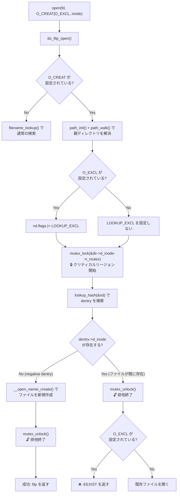

# open(2) の O_EXCL

> 🤖 Originally written by hand, revised with AI assistance.

O_CREAT|O_EXCL はどんな風に実装されているのか?

## 要約

 * EEXIST な場合に O_EXCL でエラーにするだけのシンプルな実装です
   * ディレクトリ inode の mutex で排他するので、新規に作成する操作が atomic になることが保証されます
   * O_EXCL を指定しなくても mutex で排他はなされていて、 EEXIST ならエラーとするように挙動が変わるだけです
 * open の flags に O_EXCL がたっていると LOOKUP_EXCL が設定されます
   * LOOKUP_EXCL が使われている箇所が NFS くらいしかなくて用途が分からんぞ

## do_filp_open

```c
/*
 * Note that the low bits of the passed in "open_flag"
 * are not the same as in the local variable "flag". See
 * open_to_namei_flags() for more details.
 */
struct file *do_filp_open(int dfd, struct filename *filename,
		int open_flag, int mode, int acc_mode)
{
	struct file *filp;
	struct nameidata nd;
	int error;
	struct path path;
	struct dentry *dir;
	int count = 0;
	int will_truncate;
	int flag = open_to_namei_flags(open_flag);
	int got_write = false;
	const char *pathname = filename->name;

	if (!acc_mode)
		acc_mode = MAY_OPEN | ACC_MODE(flag);

	/* O_TRUNC implies we need access checks for write permissions */
	if (flag & O_TRUNC)
		acc_mode |= MAY_WRITE;

	/* Allow the LSM permission hook to distinguish append
	   access from general write access. */
	if (flag & O_APPEND)
		acc_mode |= MAY_APPEND;

	/*
	 * The simplest case - just a plain lookup.
	 */
	if (!(flag & O_CREAT)) {
		filp = get_empty_filp();

		if (filp == NULL)
			return ERR_PTR(-ENFILE);
		nd.intent.open.file = filp;
		filp->f_flags = open_flag;
		nd.intent.open.flags = flag;
		nd.intent.open.create_mode = 0;
		error = filename_lookup(dfd, filename,
					lookup_flags(flag)|LOOKUP_OPEN, &nd);
		if (IS_ERR(nd.intent.open.file)) {
			if (error == 0) {
				error = PTR_ERR(nd.intent.open.file);
				path_put(&nd.path);
			}
		} else if (error)
			release_open_intent(&nd);
		if (error)
			return ERR_PTR(error);
		goto ok;
	}

	/*
	 * Create - we need to know the parent.
	 */
	error = path_init(dfd, pathname, LOOKUP_PARENT, &nd);
	if (error)
		return ERR_PTR(error);
	error = path_walk(filename, &nd);
	if (error) {
		if (nd.root.mnt)
			path_put(&nd.root);
		return ERR_PTR(error);
	}
	if (unlikely(!audit_dummy_context()))
		audit_inode(filename, nd.path.dentry, LOOKUP_PARENT);

	/*
	 * We have the parent and last component. First of all, check
	 * that we are not asked to creat(2) an obvious directory - that
	 * will not do.
	 */
	error = -EISDIR;
	if (nd.last_type != LAST_NORM || nd.last.name[nd.last.len])
		goto exit_parent;

	error = -ENFILE;
	filp = get_empty_filp();
	if (filp == NULL)
		goto exit_parent;
	nd.intent.open.file = filp;
	filp->f_flags = open_flag;
	nd.intent.open.flags = flag;
	nd.intent.open.create_mode = mode;
	dir = nd.path.dentry;
	nd.flags &= ~LOOKUP_PARENT;
	nd.flags |= LOOKUP_CREATE | LOOKUP_OPEN;

    //
    // LOOKUP_EXCL をたてる
    //
	if (flag & O_EXCL)
		nd.flags |= LOOKUP_EXCL;

	/*
	 * This write is needed to ensure that a
	 * ro->rw transition does not occur between
	 * the time when the file is created and when
	 * a permanent write count is taken through
	 * the 'struct file' in nameidata_to_filp().
	 */
	error = mnt_want_write(nd.path.mnt);
	if (!error)
		got_write = true;

	// -------------------------------------------------------------------------
	// ここから クリティカルリージョン
    // ディレクトリ inode で mutex
	// -------------------------------------------------------------------------
	mutex_lock(&dir->d_inode->i_mutex);
	path.dentry = lookup_hash(&nd);
	path.mnt = nd.path.mnt;

do_last:
	error = PTR_ERR(path.dentry);
	if (IS_ERR(path.dentry)) {
		mutex_unlock(&dir->d_inode->i_mutex);
		if (got_write)
			mnt_drop_write(nd.path.mnt);
		goto exit;
	}

	if (IS_ERR(nd.intent.open.file)) {
		error = PTR_ERR(nd.intent.open.file);
		goto exit_mutex_unlock;
	}

	/* Negative dentry, just create the file */
	if (!path.dentry->d_inode) {
		if (!got_write) {
			error = -EROFS;
			goto exit_mutex_unlock;
		}

        // vfs_create 呼び出し
        // ディレクトリの inode_operations .create を呼び出す
		error = __open_namei_create(&nd, &path, open_flag, mode);
		if (error) {
			mnt_drop_write(nd.path.mnt);
			goto exit;
		}
		filp = nameidata_to_filp(&nd);
		mnt_drop_write(nd.path.mnt);
		if (nd.root.mnt)
			path_put(&nd.root);
		if (!IS_ERR(filp)) {
			error = ima_file_check(filp, acc_mode);
			if (error) {
				fput(filp);
				filp = ERR_PTR(error);
			}
		}
		return filp;
	}

    // -------------------------------------------------------------------------
    // 排他終わり
    // -------------------------------------------------------------------------
	/*
	 * It already exists.
	 */
	mutex_unlock(&dir->d_inode->i_mutex);

	if (got_write) {
		mnt_drop_write(nd.path.mnt);
		got_write = false;
	}
	audit_inode(filename, path.dentry, 0);

    //
    // 1. ファイルが既にある
    //   * そもそも存在しているケース
    //   * 他のプロセスと競合していて、mutex で待っている間に作られたケース
    // 2. O_EXCL がたっていたらアトミックにファイルを新規作成しようとしたけど失敗したってことでコケる
    //
	error = -EEXIST;
	if (flag & O_EXCL)
		goto exit_dput;

	error = follow_managed(&path, nd.flags);
	if (error < 0)
		goto exit_dput;


	error = -ENOENT;
	if (!path.dentry->d_inode)
		goto exit_dput;
	if (path.dentry->d_inode->i_op->follow_link)
		goto do_link;

	path_to_nameidata(&path, &nd);
	error = -EISDIR;
	if (path.dentry->d_inode && S_ISDIR(path.dentry->d_inode->i_mode))
		goto exit;
ok:
	/*
	 * Consider:
	 * 1. may_open() truncates a file
	 * 2. a rw->ro mount transition occurs
	 * 3. nameidata_to_filp() fails due to
	 *    the ro mount.
	 * That would be inconsistent, and should
	 * be avoided. Taking this mnt write here
	 * ensures that (2) can not occur.
	 */
	will_truncate = open_will_truncate(flag, nd.path.dentry->d_inode);
	if (will_truncate) {
		error = mnt_want_write(nd.path.mnt);
		if (error)
			goto exit;
	}
	error = may_open(&nd.path, acc_mode, open_flag);
	if (error) {
		if (will_truncate)
			mnt_drop_write(nd.path.mnt);
		goto exit;
	}
	filp = nameidata_to_filp(&nd);
	if (!IS_ERR(filp)) {
		error = ima_file_check(filp, acc_mode);
		if (error) {
			fput(filp);
			filp = ERR_PTR(error);
		}
	}
	if (!IS_ERR(filp)) {
		if (acc_mode & MAY_WRITE)
			vfs_dq_init(nd.path.dentry->d_inode);

		if (will_truncate) {
			error = handle_truncate(filp);
			if (error) {
				fput(filp);
				filp = ERR_PTR(error);
			}
		}
	}
	/*
	 * It is now safe to drop the mnt write
	 * because the filp has had a write taken
	 * on its behalf.
	 */
	if (will_truncate)
		mnt_drop_write(nd.path.mnt);
	if (nd.root.mnt)
		path_put(&nd.root);
	return filp;

exit_mutex_unlock:
	mutex_unlock(&dir->d_inode->i_mutex);
	if (got_write)
		mnt_drop_write(nd.path.mnt);
exit_dput:
	path_put_conditional(&path, &nd);
exit:
	if (!IS_ERR(nd.intent.open.file))
		release_open_intent(&nd);
exit_parent:
	if (nd.root.mnt)
		path_put(&nd.root);
	path_put(&nd.path);
	return ERR_PTR(error);

do_link:
	error = -ELOOP;
	if (flag & O_NOFOLLOW)
		goto exit_dput;
	/*
	 * This is subtle. Instead of calling do_follow_link() we do the
	 * thing by hands. The reason is that this way we have zero link_count
	 * and path_walk() (called from ->follow_link) honoring LOOKUP_PARENT.
	 * After that we have the parent and last component, i.e.
	 * we are in the same situation as after the first path_walk().
	 * Well, almost - if the last component is normal we get its copy
	 * stored in nd->last.name and we will have to putname() it when we
	 * are done. Procfs-like symlinks just set LAST_BIND.
	 */
	nd.flags |= LOOKUP_PARENT;
	error = security_inode_follow_link(path.dentry, &nd);
	if (error)
		goto exit_dput;
	error = __do_follow_link(&path, &nd);
	if (error) {
		/* Does someone understand code flow here? Or it is only
		 * me so stupid? Anathema to whoever designed this non-sense
		 * with "intent.open".
		 */
		release_open_intent(&nd);
		if (nd.root.mnt)
			path_put(&nd.root);
		return ERR_PTR(error);
	}
	nd.flags &= ~LOOKUP_PARENT;
	if (nd.last_type == LAST_BIND)
		goto ok;
	error = -EISDIR;
	if (nd.last_type != LAST_NORM)
		goto exit;
	if (nd.last.name[nd.last.len]) {
		__putname(nd.last.name);
		goto exit;
	}
	error = -ELOOP;
	if (count++==32) {
		__putname(nd.last.name);
		goto exit;
	}
	dir = nd.path.dentry;
	error = mnt_want_write(nd.path.mnt);
	if (!error)
		got_write = true;
	mutex_lock(&dir->d_inode->i_mutex);
	path.dentry = lookup_hash(&nd);
	path.mnt = nd.path.mnt;
	__putname(nd.last.name);
	goto do_last;
}
```

## O_EXCL の処理フロー



🤖 上記のフローチャートは、`do_filp_open()` 内の O_EXCL の処理を図解したものです。ポイントは、ディレクトリ inode の mutex で排他している区間内で「dentry の存在確認」と「ファイルの新規作成」が atomic に行われることです。

## クリティカルリージョンの詳細

O_EXCL の atomic 性を保証するのは、以下のクリティカルリージョンです。

```
mutex_lock(&dir->d_inode->i_mutex)     ← 🔒 ロック取得
    └── lookup_hash(&nd)                ← dentry の検索
        ├── dentry が存在しない場合
        │   └── __open_namei_create()   ← ファイル作成
        │       └── mutex_unlock()      ← 🔓 ロック解放
        └── dentry が存在する場合
            └── mutex_unlock()          ← 🔓 ロック解放
                └── O_EXCL なら -EEXIST
```

ディレクトリ inode の `i_mutex` により「dentry の検索 → ファイルの作成」が不可分に実行されます。他のプロセスが同名のファイルを同時に作成しようとしても、mutex で待たされるため、先に mutex を取得したプロセスだけが作成に成功します。

🤖 O_EXCL を指定しない場合でも、この mutex による排他制御は同様に行われます。違いは、ファイルが既に存在していた場合にエラーにするかどうかだけです。

## 最新カーネル (v6.x) での改善点

🤖 本文書のコードは 2.6.x 系カーネルのものです。最新カーネルでは以下の改善が行われています。

### 関数構造のリファクタリング

`do_filp_open()` は巨大な単一関数でしたが、最新カーネルでは役割ごとに分割されています。

| 旧 (2.6.x) | 新 (v6.x) | 役割 |
|---|---|---|
| `do_filp_open()` 内の全処理 | `path_openat()` | open 処理の中核です |
| 同上 | `open_last_lookups()` | パスの最終コンポーネントの解決を担当します |
| 同上 | `do_open()` | 実際のファイルオープン処理です |

### `i_mutex` から `i_rwsem` への移行

古いカーネルではディレクトリ inode の排他制御に `i_mutex`（排他的ミューテックス）を使用していました。最新カーネルでは `i_rwsem`（読み書きセマフォ）に変更されています。

この変更により、複数の **検索操作**（読み取り操作）を並列に実行できるようになりました。ファイルの作成・削除などの **変更操作** では引き続き排他ロックを取得するため、O_EXCL の atomic 性は維持されています [^1]。

### `atomic_open()` の導入

NFS などのネットワークファイルシステム向けに `atomic_open()` inode operation が導入されました。これにより、ファイルシステムは「パス解決 → ファイル作成 → オープン」を単一の操作で実行できるようになり、ネットワーク越しの O_EXCL の整合性が向上しています [^2]。

### `LOOKUP_EXCL` の用途の変化

古いカーネルでは `LOOKUP_EXCL` は VFS で直接参照されていましたが、最新カーネルでは主にファイルシステム側の `->d_revalidate()` メソッドで利用される情報に変わっています。

[^1]: Al Viro による VFS 並列検索の取り組みについては LWN の記事が参考になります。https://lwn.net/Articles/685108/
[^2]: `atomic_open()` の VFS ドキュメント https://docs.kernel.org/filesystems/vfs.html
