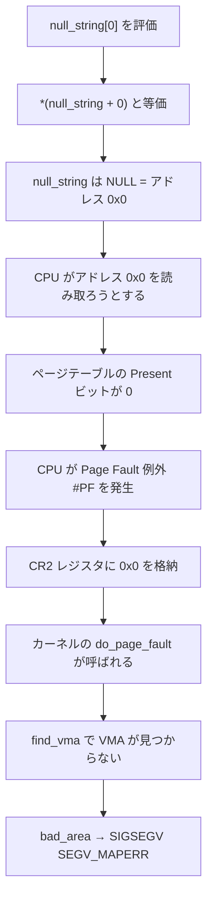
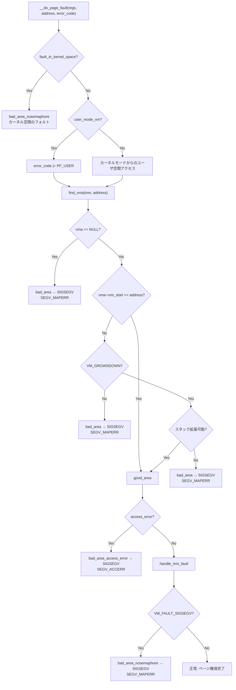

# SIGSEGV の仕組み (CentOS 6.5 / Linux 2.6.32 時代の調査)

> 🤖 Originally written by hand, revised with AI assistance.

> **注意**: この文書は CentOS 6.5 (Linux 2.6.32-431.el6.x86_64) 環境で調査した内容を元にしています。最新カーネル (6.x) では関数名やログ出力に変更があります。変更点については本文中で補足しています。

## 要約

<!-- CC添削: 要約を追加しました -->

SIGSEGV はプロセスが不正なメモリアクセスを行った際にカーネルから送信されるシグナルです。x86_64 では CPU が Page Fault 例外 (#PF) を発生させ、カーネルの `__do_page_fault()` がアクセスの正当性を検証します。VMA が見つからない場合は `SEGV_MAPERR`、権限が合わない場合は `SEGV_ACCERR` として SIGSEGV が送信されます。

---

## 現象


```console
$ ./owata
＼(^o^)／
＼(^o^)／
＼(^o^)／
Segmentation fault
```

仕組みが分かれば SIGSEGV は怖くありません。

### 再現コード: owata.c

```c
#include <stdlib.h>
#include <stdio.h>

static char *null_string = NULL;

int main()
{
	int i = 0;
	for(i = 0; i < 3; i++) {
		printf("＼(^o^)／\n");
		usleep(800000);
	}

	void *a = null_string[0];
	return 0;
}
```

### SIGSEGV が発生するメカニズム

<!-- CC添削: owata.c がなぜ SIGSEGV を起こすかの詳細な解説を追記しました -->



1. `null_string` は static 変数で、`.bss` セグメントに配置されます。プログラムロード時にゼロクリアされ NULL (`0x0`) になります
2. `null_string[0]` は `*(null_string + 0)` と等価で、アドレス `0x0` のメモリ読み取りを試みます
3. アドレス `0x0` にはページがマッピングされていないため、CPU が Page Fault 例外を発生させます
4. カーネルの page fault ハンドラが VMA を検索しますが見つからず、`bad_area()` を経由して SIGSEGV を送信します

<!-- CC添削: mmap_min_addr によるセキュリティ保護について追記しました -->

アドレス `0x0` にページがマッピングされていない理由は、`vm.mmap_min_addr` (デフォルト: 65536) によりユーザ空間プロセスが低位アドレスに `mmap()` することが禁止されているためです。この保護がなければ、カーネル内の NULL ポインタデリファレンスバグと組み合わせて権限昇格攻撃が可能になります。

---

## sysctl debug.exception-trace

`show_unhandled_signals` 変数を制御する sysctl です。有効にすると、ハンドルされていないシグナル（segfault 等）を syslog に記録します。

```sh
$ sudo sysctl -w debug.exception-trace=1
```

```c
static struct ctl_table debug_table[] = {
#if defined(CONFIG_X86) || defined(CONFIG_PPC)
	{
		.ctl_name	= CTL_UNNUMBERED,
		.procname	= "exception-trace",
		.data		= &show_unhandled_signals,
		.maxlen		= sizeof(int),
		.mode		= 0644,
		.proc_handler	= proc_dointvec_minmax,
		.extra1		= &zero,
	},
```

/var/log/messages にフォールトを起こしたログを出す sysctl 設定。 CentOS6.5 は デフォルト = 1

```
Jul  6 04:01:43 vagrant-centos65 kernel: a.out[25311]: segfault at 0 ip 0000000000400546 sp 00007fff2fb08610 error 4 in a.out[400000+1000]
```

このログから以下の情報を読み取れます。

 * `at 0` — NULL ポインタでのフォールトです
 * `ip` — フォールト発生時の命令アドレスです
 * `error 4` — ユーザ空間での読み取りフォールトです（ビット分解は後述）

SIGSEGV の際にログを出す関数は `show_signal_msg()` です。

### segfault ログの各フィールドの意味

<!-- CC添削: segfault ログの読み方を表形式で追記しました -->

| フィールド | 値の例 | 意味 |
|---|---|---|
| `a.out[25311]` | プロセス名[PID] | `tsk->comm` と `task_pid_nr(tsk)` から取得します |
| `at 0` | フォールトアドレス | CR2 レジスタの値です。`0` は NULL ポインタデリファレンスを示します |
| `ip 0000000000400546` | Instruction Pointer | フォールト発生時の RIP レジスタの値です |
| `sp 00007fff2fb08610` | Stack Pointer | フォールト発生時の RSP レジスタの値です |
| `error 4` | エラーコード | x86 ページフォールトのエラーコードです（下記参照） |
| `in a.out[400000+1000]` | VMA 情報 | `print_vma_addr()` が出力します。VMA の開始アドレスとサイズです |

### error コードのビット分解

<!-- CC添削: error コードのビットフィールドの意味を追記しました -->

error コードは x86 CPU がページフォールト時にスタックにプッシュするハードウェア定義の値です。

```c
/* arch/x86/mm/fault.c (2.6.32) */
enum x86_pf_error_code {
    PF_PROT   = 1 << 0,  /* 0: ページなし         1: 保護違反 */
    PF_WRITE  = 1 << 1,  /* 0: 読み取り           1: 書き込み */
    PF_USER   = 1 << 2,  /* 0: カーネルモード     1: ユーザモード */
    PF_RSVD   = 1 << 3,  /* 1: 予約ビット違反 */
    PF_INSTR  = 1 << 4,  /* 1: 命令フェッチ */
};
```

| error 値 | ビット分解 | 意味 |
|---|---|---|
| **4** | `PF_USER` | ユーザモードで、マッピングされていないページへの読み取り。NULL ポインタデリファレンスの典型です |
| **6** | `PF_USER \| PF_WRITE` | ユーザモードで、マッピングされていないページへの書き込みです |
| **5** | `PF_USER \| PF_PROT` | ユーザモードで、存在するページへの保護違反（読み取り禁止領域）です |
| **7** | `PF_USER \| PF_WRITE \| PF_PROT` | ユーザモードで、読み取り専用ページへの書き込みです |
| **14** | `PF_USER \| PF_WRITE \| PF_RSVD` | ユーザモードで、予約ビットが設定されたページテーブルエントリへの書き込みです。ページテーブル破壊の可能性を示します |
| **20** | `PF_USER \| PF_INSTR` | ユーザモードで、実行不可 (NX) ページからの命令フェッチです |

<!-- CC添削: 最新カーネルでは PF_* が X86_PF_* にリネームされ、Protection Keys (X86_PF_PK)、Shadow Stack (X86_PF_SHSTK)、SGX (X86_PF_SGX) のビットが追加されています -->

### show_signal_msg の実装

```c
/*
 * Print out info about fatal segfaults, if the show_unhandled_signals
 * sysctl is set:
 */
static inline void
show_signal_msg(struct pt_regs *regs, unsigned long error_code,
		unsigned long address, struct task_struct *tsk)
{
	if (!unhandled_signal(tsk, SIGSEGV))
		return;

	if (!printk_ratelimit())
		return;

	printk("%s%s[%d]: segfault at %lx ip %p sp %p error %lx",
		task_pid_nr(tsk) > 1 ? KERN_INFO : KERN_EMERG,
		tsk->comm, task_pid_nr(tsk), address,
		(void *)regs->ip, (void *)regs->sp, error_code);

	print_vma_addr(KERN_CONT " in ", regs->ip);

	printk(KERN_CONT "\n");
}
```

<!-- CC添削: 最新カーネル (6.x) では show_signal_msg に以下の変更が入っています:
  - ポインタフォーマットが %p → %px に変更（v4.15 のポインタハッシュ化対策）
  - CPU 情報 "likely on CPU %d (core %d, socket %d)" が追加
  - show_opcodes() でフォルト地点の命令バイトダンプが追加
-->

`show_unhandled_signals` は segfault 以外にも、`trap` (SIGTRAP) や `general protection` (SIGSEGV/不正命令) のログ出力にも使われています。

---

## sysctl kernel.print-fatal-signals

```
sudo sysctl -w kernel.print-fatal-signals=1
```

debug.exception-trace よりもうちょっと詳しいログを出してくれる

```
Jul  6 04:01:43 vagrant-centos65 kernel: a.out[25311]: segfault at 0 ip 0000000000400546 sp 00007fff2fb08610 error 4 in a.out[400000+1000]
Jul  6 04:01:43 vagrant-centos65 kernel: a.out/25311: potentially unexpected fatal signal 11.
Jul  6 04:01:43 vagrant-centos65 kernel:
Jul  6 04:01:43 vagrant-centos65 kernel: CPU 0
Jul  6 04:01:43 vagrant-centos65 kernel: Modules linked in: ipt_addrtype xt_conntrack iptable_filter ipt_MASQUERADE iptable_nat nf_nat nf_conntrack_ipv4 nf_conntrack nf_defrag_ipv4 ip_tables bridge stp llc dm_thin_pool dm_bio_prison dm_persistent_data dm_bufio libcrc32c vboxsf(U) ipv6 ppdev parport_pc parport sg i2c_piix4 i2c_core vboxguest(U) virtio_net ext4 jbd2 mbcache sd_mod crc_t10dif ahci virtio_pci virtio_ring virtio dm_mirror dm_region_hash dm_log dm_mod [last unloaded: scsi_wait_scan]
Jul  6 04:01:43 vagrant-centos65 kernel:
Jul  6 04:01:43 vagrant-centos65 kernel: Pid: 25311, comm: a.out Tainted: G           --------------- H  2.6.32-431.el6.x86_64 #1 innotek GmbH VirtualBox/VirtualBox
Jul  6 04:01:43 vagrant-centos65 kernel: RIP: 0033:[<0000000000400546>]  [<0000000000400546>] 0x400546
Jul  6 04:01:43 vagrant-centos65 kernel: RSP: 002b:00007fff2fb08610  EFLAGS: 00010202
Jul  6 04:01:43 vagrant-centos65 kernel: RAX: 0000000000000000 RBX: 0000000000000000 RCX: 00007ff900c7ecc0
Jul  6 04:01:43 vagrant-centos65 kernel: RDX: 0000000000000000 RSI: 0000000000000000 RDI: 00007fff2fb085f0
Jul  6 04:01:43 vagrant-centos65 kernel: RBP: 00007fff2fb08620 R08: 000000000000000b R09: 00007ff90117b700
Jul  6 04:01:43 vagrant-centos65 kernel: R10: 00007fff2fb08390 R11: 0000000000000246 R12: 0000000000400420
Jul  6 04:01:43 vagrant-centos65 kernel: R13: 00007fff2fb08720 R14: 0000000000000000 R15: 0000000000000000
Jul  6 04:01:43 vagrant-centos65 kernel: FS:  00007ff90117b700(0000) GS:ffff880002200000(0000) knlGS:0000000000000000
Jul  6 04:01:43 vagrant-centos65 kernel: CS:  0010 DS: 0000 ES: 0000 CR0: 000000008005003b
Jul  6 04:01:43 vagrant-centos65 kernel: CR2: 0000000000000000 CR3: 000000003bdab000 CR4: 00000000000006f0
Jul  6 04:01:43 vagrant-centos65 kernel: DR0: 0000000000000000 DR1: 0000000000000000 DR2: 0000000000000000
Jul  6 04:01:43 vagrant-centos65 kernel: DR3: 0000000000000000 DR6: 00000000ffff4ff0 DR7: 0000000000000400
Jul  6 04:01:43 vagrant-centos65 kernel: Process a.out (pid: 25311, threadinfo ffff88003bd56000, task ffff88003c7d8aa0)
Jul  6 04:01:43 vagrant-centos65 kernel:
Jul  6 04:01:43 vagrant-centos65 kernel: Call Trace:
```

レジスタダンプ、ロード済みモジュール一覧、コールトレースが出力されます。`CR2: 0000000000000000` からフォールトアドレスが `0x0` (= NULL ポインタデリファレンス) であることを確認できます。

### debug.exception-trace と kernel.print-fatal-signals の比較

<!-- CC添削: 2つの sysctl の違いを表で整理しました -->

| 項目 | `debug.exception-trace` | `kernel.print-fatal-signals` |
|---|---|---|
| デフォルト | 1（有効） | 0（無効） |
| 出力関数 | `show_signal_msg()` | `print_fatal_signal()` → `show_regs()` |
| ソースファイル | `arch/x86/mm/fault.c` | `kernel/signal.c` |
| 出力量 | 1 行 | レジスタダンプ + モジュール一覧 + コールトレース |
| 対象 | ページフォールト由来のみ（SIGSEGV 等） | coredump シグナル全般（SIGABRT, SIGBUS, SIGFPE, SIGILL 等も含む） |
| アーキテクチャ依存 | x86, PowerPC のみ | アーキテクチャ非依存 |

### segfault ログからクラッシュ箇所を特定する方法

<!-- CC添削: デバッグ手法を追記しました -->

```bash
# 1. dmesg からログを取得する
dmesg | grep segfault
# a.out[25311]: segfault at 0 ip 0000000000400546 ... in a.out[400000+1000]

# 2. addr2line でソースコードの行番号に変換する（デバッグ情報付きでコンパイルした場合）
addr2line -f -e a.out 0x400546
# 出力例:
# main
# /home/user/owata.c:29

# 3. objdump で命令レベルの確認をする
objdump -d a.out | grep -A5 "400546"

# 4. coredump から gdb で解析する
gdb ./a.out core.25311
(gdb) bt          # バックトレース表示
(gdb) info registers  # レジスタ表示
```

---

# SIGSEGV を出すカーネルコード

## SEGV_MAPERR と SEGV_ACCERR

<!-- CC添削: si_code の説明を補足しました -->

SIGSEGV の `si_code` には 2 種類あります。

| si_code | 意味 | 発生条件 |
|---|---|---|
| `SEGV_MAPERR` | アドレスがどの VMA にもマッピングされていません | `find_vma()` が NULL を返した場合、または VMA の範囲外へのアクセスです |
| `SEGV_ACCERR` | VMA は存在するがアクセス権限がありません | 読み取り専用ページへの書き込み、実行不可ページからの命令フェッチなどです |

## bad_area

 * bad_area = SEGV_MAPERR
   * vm_area_struct がマップされていないアドレスにアクセスしようとした
 * bad_area_access_error = SEGV_ACCERR
   * フォールト時の権限が vm_area_struct とマッチしなかった

```c
static noinline void
bad_area(struct pt_regs *regs, unsigned long error_code, unsigned long address)
{
	__bad_area(regs, error_code, address, SEGV_MAPERR);
}
```

```c
static noinline void
bad_area_access_error(struct pt_regs *regs, unsigned long error_code,
		      unsigned long address)
{
	__bad_area(regs, error_code, address, SEGV_ACCERR);
}
```

bad_area, bad_area_access_error 共に __bad_area_nosemaphore を呼び出す

```c
static void
__bad_area_nosemaphore(struct pt_regs *regs, unsigned long error_code,
		       unsigned long address, int si_code)
{
	struct task_struct *tsk = current;

	/* User mode accesses just cause a SIGSEGV */
	if (error_code & PF_USER) {
		/*
		 * It's possible to have interrupts off here:
		 */
		local_irq_enable();

		/*
		 * Valid to do another page fault here because this one came
		 * from user space:
		 */
		if (is_prefetch(regs, error_code, address))
			return;

		if (is_errata100(regs, address))
			return;

		if (unlikely(show_unhandled_signals))
			show_signal_msg(regs, error_code, address, tsk);

		/* Kernel addresses are always protection faults: */
		tsk->thread.cr2		= address;
		tsk->thread.error_code	= error_code | (address >= TASK_SIZE);
		tsk->thread.trap_no	= 14;

		force_sig_info_fault(SIGSEGV, si_code, address, tsk, 0);

		return;
	}

	if (is_f00f_bug(regs, address))
		return;

	no_context(regs, error_code, address);
}
```

__bad_area_nosemaphore は force_sig_info_fault で SIGSEGV を強制して飛ばす

<!-- CC添削: 最新カーネル (6.x) では force_sig_info_fault は削除され、force_sig_fault(SIGSEGV, si_code, (void __user *)address) に置き換えられています -->

```c
static void
force_sig_info_fault(int si_signo, int si_code, unsigned long address,
		     struct task_struct *tsk, int fault)
{
	unsigned lsb = 0;
	siginfo_t info;

	info.si_signo	= si_signo;
	info.si_errno	= 0;
	info.si_code	= si_code;
	info.si_addr	= (void __user *)address;
	if (fault & VM_FAULT_HWPOISON_LARGE)
		lsb = hstate_index_to_shift(VM_FAULT_GET_HINDEX(fault));
	if (fault & VM_FAULT_HWPOISON)
		lsb = PAGE_SHIFT;
	info.si_addr_lsb = lsb;

	force_sig_info(si_signo, &info, tsk);
}
```

## __do_page_fault

x86_64 では、 bad_area, bad_area_access_error 共に __do_page_fault でのみ使われている。ここを読めば SIGSEGV の仕組みを知れる

### SIGSEGV に至るパスの全体像

<!-- CC添削: __do_page_fault 内の SIGSEGV に至るパスを mermaid で図示しました -->



<!-- CC添削: 最新カーネル (6.x) では __do_page_fault は以下の4関数に再編されています:
  - exc_page_fault(): IDT エントリポイント
  - handle_page_fault(): カーネル/ユーザ空間の振り分け
  - do_kern_addr_fault(): カーネルアドレス空間のフォルト
  - do_user_addr_fault(): ユーザアドレス空間のフォルト（VMA 検索、SIGSEGV 送信）
  また、Protection Keys 違反の場合は SEGV_PKUERR が追加されています
-->

### __do_page_fault のソースコード

```c
static inline void __do_page_fault(struct pt_regs *regs, unsigned long address, unsigned long error_code)
{
	struct vm_area_struct *vma;
	struct task_struct *tsk;
	struct mm_struct *mm;
	int fault;
	int write = error_code & PF_WRITE;
	unsigned int flags = FAULT_FLAG_ALLOW_RETRY | FAULT_FLAG_KILLABLE |
					(write ? FAULT_FLAG_WRITE : 0);

	tsk = current;
	mm = tsk->mm;

	/* ----------------------------------------------------------------
	 * 🤖 【前処理】kmemcheck / mmiotrace の処理
	 * kmemcheck はデバッグ用の機能で、未初期化メモリのアクセスを検出します
	 * kmmio_fault は MMIO (Memory-Mapped I/O) のトレース用です
	 * いずれも通常の SIGSEGV パスには関係しません
	 * ---------------------------------------------------------------- */

	if (kmemcheck_active(regs))
		kmemcheck_hide(regs);
	prefetchw(&mm->mmap_sem);  /* 🤖 mmap_sem の取得に備えてキャッシュラインをプリフェッチします */

	if (unlikely(kmmio_fault(regs, address)))
		return;

	/* ----------------------------------------------------------------
	 * 🤖 【カーネル空間のフォルト処理】
	 * フォールトアドレスがカーネル空間の場合の処理です
	 * vmalloc で確保された領域のページフォルトは正常なケースで、
	 * init_mm のページテーブルからコピーして解決します
	 * 解決できない場合は bad_area_nosemaphore → OOPS になります
	 * ---------------------------------------------------------------- */

	if (unlikely(fault_in_kernel_space(address))) {
		if (!(error_code & (PF_RSVD | PF_USER | PF_PROT))) {
			if (vmalloc_fault(address) >= 0)  /* 🤖 vmalloc 領域のフォルトを解決します */
				return;

			if (kmemcheck_fault(regs, address, error_code))
				return;
		}

		if (spurious_fault(error_code, address))  /* 🤖 TLB のキャッシュが古い場合のフォルトを処理します */
			return;

		if (notify_page_fault(regs))  /* 🤖 kprobes にフォルトを通知します */
			return;

		bad_area_nosemaphore(regs, error_code, address);  /* 🤖 ここに到達するとカーネル OOPS になります */

		return;
	}

	/* ----------------------------------------------------------------
	 * 🤖 【ユーザ空間のフォルト処理 - 前半】
	 * ここからがユーザ空間のページフォルト処理です
	 * SIGSEGV の発生はこのパスで起こります
	 * ---------------------------------------------------------------- */

	if (unlikely(notify_page_fault(regs)))
		return;

	/* 🤖 ユーザモードからのフォルトなら PF_USER フラグを立てます
	 * このフラグが後続の bad_area 系関数で SIGSEGV を送るかどうかの判定に使われます */
	if (user_mode_vm(regs)) {
		local_irq_enable();
		error_code |= PF_USER;
	} else {
		if (regs->flags & X86_EFLAGS_IF)
			local_irq_enable();
	}

	/* 🤖 予約ビット違反はページテーブルの破壊を意味するため、即座にエラーにします */
	if (unlikely(error_code & PF_RSVD))
		pgtable_bad(regs, error_code, address);

	perf_sw_event(PERF_COUNT_SW_PAGE_FAULTS, 1, regs, address);  /* 🤖 perf のページフォルトカウンタをインクリメントします */

	/* 🤖 割り込みコンテキスト、atomic コンテキスト、mm が NULL の場合は
	 * ページフォルトを処理できないため、即座に bad_area にします */
	if (unlikely(in_atomic() || !mm)) {
		bad_area_nosemaphore(regs, error_code, address);
		return;
	}

	/* ----------------------------------------------------------------
	 * 🤖 【mmap_sem の取得】
	 * VMA を検索するために mmap_sem (読み取りロック) を取得します
	 * trylock に失敗した場合、カーネルモードからのアクセスで
	 * exception_tables に登録されていなければ bad_area にします
	 * （デッドロック回避のため）
	 * ---------------------------------------------------------------- */
	if (unlikely(!down_read_trylock(&mm->mmap_sem))) {
		if ((error_code & PF_USER) == 0 &&
		    !search_exception_tables(regs->ip)) {
			bad_area_nosemaphore(regs, error_code, address);
			return;
		}
retry:
		down_read(&mm->mmap_sem);
	} else {
		might_sleep();
	}

	/* ----------------------------------------------------------------
	 * 🤖 【VMA 検索と SIGSEGV 判定 - ここが SIGSEGV の核心部分】
	 * find_vma() でフォールトアドレスを含む VMA を検索します
	 * ---------------------------------------------------------------- */

	vma = find_vma(mm, address);

	/* 🤖 ★ SIGSEGV パス 1: VMA が見つからない → SEGV_MAPERR
	 * アドレスがどの VMA にもマッピングされていません
	 * NULL ポインタデリファレンス (address=0) はここに該当します */
	if (unlikely(!vma)) {
		bad_area(regs, error_code, address);
		return;
	}

	/* 🤖 find_vma() は vm_end > address となる最初の VMA を返します
	 * vm_start <= address なら、アドレスは VMA の範囲内です */
	if (likely(vma->vm_start <= address))
		goto good_area;

	/* 🤖 ★ SIGSEGV パス 2: VMA の範囲外で VM_GROWSDOWN でもない → SEGV_MAPERR
	 * スタック VMA 以外で、VMA の手前のアドレスにアクセスした場合です */
	if (unlikely(!(vma->vm_flags & VM_GROWSDOWN))) {
		bad_area(regs, error_code, address);
		return;
	}

	/* 🤖 スタック VMA の場合: スタックの拡張を試みます
	 * ただし %sp から 65536 + 32*8 バイト以上離れたアドレスへのアクセスは
	 * スタックの正常な拡張ではないため bad_area にします */
	if (error_code & PF_USER) {
		if (unlikely(address + 65536 + 32 * sizeof(unsigned long) < regs->sp)) {
			bad_area(regs, error_code, address);  /* 🤖 ★ SIGSEGV パス 3: スタック範囲外 → SEGV_MAPERR */
			return;
		}
	}

	/* 🤖 ★ SIGSEGV パス 4: expand_stack 失敗 → SEGV_MAPERR
	 * RLIMIT_STACK を超えた場合などに expand_stack が失敗します */
	if (unlikely(expand_stack(vma, address))) {
		bad_area(regs, error_code, address);
		return;
	}

	/* ----------------------------------------------------------------
	 * 🤖 【good_area: VMA は見つかった。アクセス権限のチェック】
	 * ---------------------------------------------------------------- */
good_area:
	/* 🤖 ★ SIGSEGV パス 5: 権限違反 → SEGV_ACCERR
	 * 例: 読み取り専用ページへの書き込み、NX ページからの命令フェッチ */
	if (unlikely(access_error(error_code, write, vma))) {
		bad_area_access_error(regs, error_code, address);
		return;
	}

	/* ----------------------------------------------------------------
	 * 🤖 【ページフォルトの実処理】
	 * handle_mm_fault() が物理ページの割り当てやスワップインを行います
	 * ここが正常な（SIGSEGV にならない）ページフォルトの処理パスです
	 * ---------------------------------------------------------------- */
	fault = handle_mm_fault(mm, vma, address, flags);

	/* 🤖 handle_mm_fault が VM_FAULT_SIGSEGV を返した場合も
	 * mm_fault_error → bad_area_nosemaphore 経由で SIGSEGV になります */
	if (unlikely(fault & (VM_FAULT_RETRY|VM_FAULT_ERROR))) {
		if (mm_fault_error(regs, error_code, address, fault))
			return;
	}

	/* 🤖 メジャー/マイナーページフォルトの統計カウンタを更新します
	 * /proc/<pid>/stat の maj_flt, min_flt に反映されます */
	if (flags & FAULT_FLAG_ALLOW_RETRY) {
		if (fault & VM_FAULT_MAJOR) {
			tsk->maj_flt++;
			perf_sw_event(PERF_COUNT_SW_PAGE_FAULTS_MAJ, 1,
				      regs, address);
		} else {
			tsk->min_flt++;
			perf_sw_event(PERF_COUNT_SW_PAGE_FAULTS_MIN, 1,
				      regs, address);
		}
		if (fault & VM_FAULT_RETRY) {
			flags &= ~FAULT_FLAG_ALLOW_RETRY;  /* 🤖 リトライは1回だけ許可します（starvation 防止） */
			goto retry;
		}
	}

	check_v8086_mode(regs, address, tsk);  /* 🤖 VM86 モード（16bit互換）のレジスタ復元です */

	up_read(&mm->mmap_sem);  /* 🤖 mmap_sem を解放して終了です */
}
```

---

## 参考ソース・参考資料

<!-- CC添削: 参考ソース・参考資料セクションを追記しました -->

### カーネルソース

| ファイル | 関数・定義 | 内容 |
|---|---|---|
| [`arch/x86/mm/fault.c`](https://github.com/torvalds/linux/blob/master/arch/x86/mm/fault.c) | `exc_page_fault()`, `do_user_addr_fault()`, `show_signal_msg()`, `bad_area()` | x86 page fault ハンドラの実装です |
| [`arch/x86/include/asm/trap_pf.h`](https://github.com/torvalds/linux/blob/master/arch/x86/include/asm/trap_pf.h) | `enum x86_pf_error_code` | ページフォールトのエラーコードのビットフィールド定義です |
| [`kernel/signal.c`](https://github.com/torvalds/linux/blob/master/kernel/signal.c) | `print_fatal_signal()`, `get_signal()` | `kernel.print-fatal-signals` の実装です |
| [`include/linux/signal.h`](https://github.com/torvalds/linux/blob/master/include/linux/signal.h) | `sig_kernel_coredump()` | coredump 対象シグナルの判定マクロです |

### 外部資料

| 参照 | 内容 |
|---|---|
| [Fun with NULL pointers, part 1 - LWN.net](https://lwn.net/Articles/342330/) | NULL ポインタデリファレンスの悪用と `mmap_min_addr` の解説です |
| [Intel SDM Vol. 3A, Section 4.7](https://www.intel.com/content/www/us/en/developer/articles/technical/intel-sdm.html) | x86 Page Fault Exception (#PF) のエラーコード定義です |
