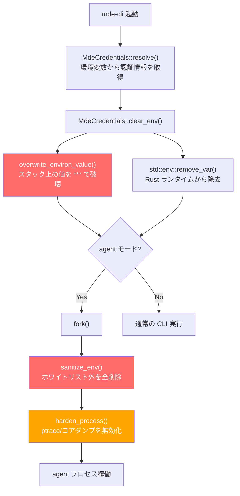

# environ の in-place 上書き — setenv/unsetenv では代替できない理由

> 🤖 This document was generated by AI.

mde-cli の `overwrite_environ_value` 実装と、Linux / macOS それぞれのカーネル・libc レベルの振る舞いを詳細に解説します。

## 目次

- [1. mde-cli の実装](#1-mde-cli-の実装)
- [2. Linux: /proc/\[pid\]/environ のカーネル実装](#2-linux-procpidenviron-のカーネル実装)
- [3. macOS: KERN_PROCARGS2 のカーネル実装](#3-macos-kern_procargs2-のカーネル実装)
- [4. setenv/unsetenv の libc 実装（共通）](#4-setenvunsetenv-の-libc-実装共通)
- [5. 比較表](#5-比較表)
- [6. まとめ](#6-まとめ)

---

## 1. mde-cli の実装

### 1.1 overwrite_environ_value（src/config/mod.rs）

C の `extern { static environ }` を直接たどり、環境変数の値部分を `*` で in-place 上書きします。

```rust
/// C の environ ポインタを直接走査し、KEY=VALUE の VALUE 部分を '*' で上書きする。
/// std::env::remove_var() だけでは /proc/[pid]/environ のスナップショットに
/// 元の値が残るため、この unsafe 操作が必要。
unsafe fn overwrite_environ_value(key: &str) {
    extern "C" {
        static environ: *const *const c_char;
    }

    let env_ptr = environ;
    if env_ptr.is_null() {
        return;
    }

    let prefix = format!("{}=", key);
    let mut i = 0;
    loop {
        let entry = *env_ptr.add(i);
        if entry.is_null() {
            break;
        }

        let entry_str = CStr::from_ptr(entry).to_bytes();
        if entry_str.starts_with(prefix.as_bytes()) {
            // '=' の次のバイトから末尾まで '*' で上書き
            let value_start = entry.add(prefix.len());
            let value_len = entry_str.len() - prefix.len();
            for j in 0..value_len {
                *(value_start.add(j) as *mut u8) = b'*';
            }
        }
        i += 1;
    }
}
```

処理の流れは次のとおりです。

```
environ[0] → "MDE_CLIENT_SECRET=s3cr3t\0"  (スタック上)
environ[1] → "HOME=/home/user\0"           (スタック上)
environ[2] → NULL

overwrite_environ_value("MDE_CLIENT_SECRET") 実行後:

environ[0] → "MDE_CLIENT_SECRET=******\0"  ← スタック上のバイト列が直接書き換わる
environ[1] → "HOME=/home/user\0"           (変更なし)
```

### 1.2 MdeCredentials::clear_env（src/config/mod.rs）

`overwrite_environ_value` と `std::env::remove_var` を組み合わせて、二段階で環境変数を消去します。

```rust
pub fn clear_env(&self) {
    const ENV_KEYS: &[&str] = &[
        "MDE_TENANT_ID",
        "MDE_CLIENT_ID",
        "MDE_CLIENT_SECRET",
        "MDE_ACCESS_TOKEN",
    ];

    for key in ENV_KEYS {
        // 第1段階: スタック上の値を '*' で上書き（/proc/[pid]/environ 対策）
        unsafe { overwrite_environ_value(key) };
        // 第2段階: Rust ランタイムの環境変数テーブルからエントリを除去
        std::env::remove_var(key);
    }
}
```

### 1.3 sanitize_env（src/agent/mod.rs）

agent プロセス（fork 後の子プロセス）で、ホワイトリスト方式で不要な環境変数をすべて削除します。

```rust
const ENV_WHITELIST: &[&str] = &[
    // パス解決
    "HOME", "PATH", "USER", "TMPDIR",
    // XDG
    "XDG_DATA_HOME", "XDG_CONFIG_HOME", "XDG_RUNTIME_DIR",
    // プロキシ
    "HTTP_PROXY", "HTTPS_PROXY", "ALL_PROXY", "NO_PROXY",
    "http_proxy", "https_proxy", "all_proxy", "no_proxy",
    // TLS
    "SSL_CERT_FILE", "SSL_CERT_DIR",
    // ロケール
    "LANG",
    // デバッグ
    "RUST_LOG", "RUST_BACKTRACE",
];

pub fn sanitize_env() {
    let all_vars: Vec<String> = std::env::vars()
        .map(|(k, _)| k)
        .collect();

    for key in &all_vars {
        if !is_env_whitelisted(key) {
            unsafe { overwrite_environ_value(key) };
            std::env::remove_var(key);
        }
    }
}
```

MDE の認証情報（`MDE_TENANT_ID` 等）は**ホワイトリストに含まれていない**ため、fork 前に `MdeCredentials` 構造体に取り込んでから `sanitize_env` で消去されます。

### 1.4 harden_process（src/agent/mod.rs）

プロセスのメモリ読み取りを OS レベルで防止します。

```rust
pub fn harden_process() {
    // コアダンプを無効化（Linux/macOS 共通）
    unsafe {
        let rlim = libc::rlimit { rlim_cur: 0, rlim_max: 0 };
        libc::setrlimit(libc::RLIMIT_CORE, &rlim);
    }

    #[cfg(target_os = "linux")]
    unsafe {
        // ptrace によるメモリ読み取りを拒否
        libc::prctl(libc::PR_SET_DUMPABLE, 0);
    }

    #[cfg(target_os = "macos")]
    unsafe {
        // デバッガのアタッチを拒否
        libc::ptrace(libc::PT_DENY_ATTACH, 0, std::ptr::null_mut(), 0);
    }
}
```

### 1.5 防御の全体像



---

## 2. Linux: /proc/[pid]/environ のカーネル実装

### 2.1 execve 時のスタック配置

`execve(2)` が呼ばれると、カーネルは環境変数の文字列をプロセスのスタック上にコピーし、そのアドレス範囲を `mm_struct` に記録します。

```c
/* fs/binfmt_elf.c - create_elf_tables() */

/* 環境変数部分: env_start〜env_end を確定 */
mm->env_end = mm->env_start = p;
while (envc-- > 0) {
    size_t len;
    if (put_user((elf_addr_t)p, sp++))      /* envp[] ポインタ配列を構築 */
        return -EFAULT;
    len = strnlen_user((void __user *)p, MAX_ARG_STRLEN);
    if (!len || len > MAX_ARG_STRLEN)
        return -EINVAL;
    p += len;
}
if (put_user(0, sp++))
    return -EFAULT;
mm->env_end = p;                              /* ← ここで範囲が確定する */
```

この `env_start` / `env_end` は execve 時に一度だけ設定され、以降は変更されません[^1]。

### 2.2 スタック上のメモリレイアウト

```
高アドレス
  ┌─────────────────────────────────┐
  │ 環境変数文字列                    │ ← mm->env_start 〜 mm->env_end
  │   "HOME=/home/user\0"           │   カーネルが参照する固定範囲
  │   "PATH=/usr/bin\0"             │
  │   "MDE_CLIENT_SECRET=s3cr3t\0"  │
  ├─────────────────────────────────┤
  │ 引数文字列                       │ ← mm->arg_start 〜 mm->arg_end
  │   "./mde-cli\0"                 │
  │   "alerts\0"                    │
  ├─────────────────────────────────┤
  │ auxv[], envp[], argv[], argc    │
低アドレス
```

### 2.3 /proc/[pid]/environ の読み取り

```c
/* fs/proc/base.c - environ_read() */
static ssize_t environ_read(struct file *file, char __user *buf,
                            size_t count, loff_t *ppos)
{
    struct mm_struct *mm = file->private_data;
    unsigned long env_start, env_end;

    /* env_start / env_end を arg_lock の保護下で取得 */
    spin_lock(&mm->arg_lock);
    env_start = mm->env_start;
    env_end = mm->env_end;
    spin_unlock(&mm->arg_lock);

    while (count > 0) {
        if (src >= (env_end - env_start))
            break;

        this_len = env_end - (env_start + src);
        /* ★ スタック上の固定アドレス範囲を直接読む */
        retval = access_remote_vm(mm, (env_start + src),
                                  page, this_len, FOLL_ANON);
        /* ... copy_to_user ... */
    }
}
```

`access_remote_vm` は対象プロセスのアドレス空間（ページテーブル）を直接読み取ります。ユーザ空間の `environ` ポインタ変数は一切参照しません。

### 2.4 setenv(3) 後に /proc/[pid]/environ が変化しない理由

```
setenv("NEW_VAR", "value", 1) 呼び出し後:

スタック上 (env_start 〜 env_end):          ← カーネルが読む範囲
  ┌───────────────────────────────────┐
  │ "HOME=/home/user\0"               │  ← 変化なし
  │ "PATH=/usr/bin\0"                 │  ← 変化なし
  │ "MDE_CLIENT_SECRET=s3cr3t\0"      │  ← 変化なし ★ 秘密情報が残る
  └───────────────────────────────────┘

ヒープ上:                                    ← カーネルは参照しない
  ┌───────────────────────────────────┐
  │ "NEW_VAR=value\0"                 │  ← malloc で確保された新しい文字列
  └───────────────────────────────────┘

environ ポインタ配列 (realloc でヒープに移動):
  environ[0] → スタック上 "HOME=..."
  environ[1] → スタック上 "PATH=..."
  environ[2] → スタック上 "MDE_CLIENT_SECRET=s3cr3t"  ← ポインタは残っている
  environ[3] → ヒープ上 "NEW_VAR=value"
```

`setenv` はヒープ上に新しい文字列を確保し、`environ` ポインタ配列を更新するだけです。スタック上の元の文字列バイト列は一切変更しません。カーネルは `env_start`〜`env_end` の固定範囲のみを読むため、`setenv` の結果は `/proc/[pid]/environ` に反映されません。

### 2.5 unsetenv(3) 後も /proc/[pid]/environ に値が残る理由

`unsetenv` は `environ` ポインタ配列からエントリを除去するだけです。スタック上のバイト列は破壊しません。

```
unsetenv("MDE_CLIENT_SECRET") 呼び出し後:

スタック上 (env_start 〜 env_end):
  ┌───────────────────────────────────┐
  │ "HOME=/home/user\0"               │
  │ "PATH=/usr/bin\0"                 │
  │ "MDE_CLIENT_SECRET=s3cr3t\0"      │  ← ★ バイト列はそのまま残る
  └───────────────────────────────────┘

environ ポインタ配列:
  environ[0] → "HOME=..."
  environ[1] → "PATH=..."
  environ[2] → NULL                        ← ポインタは除去されたが...
```

`cat /proc/[pid]/environ` すると `MDE_CLIENT_SECRET=s3cr3t` が依然として表示されます。

---

## 3. macOS: KERN_PROCARGS2 のカーネル実装

### 3.1 /proc が存在しない

macOS には procfs が存在しません。代わりに `sysctl` の `KERN_PROCARGS2` で他プロセスの環境変数を読み取ります。

### 3.2 KERN_PROCARGS2 の読み取り

xnu カーネルの `sysctl_procargsx()` は、プロセスのユーザースタック領域を `vm_map_copyin()` で直接読み取ります。

```c
/* xnu: bsd/kern/kern_sysctl.c - sysctl_procargsx() */
ret = vm_map_copyin(proc_map,
    (vm_map_address_t)arg_addr,         /* p->user_stack の値 */
    (vm_map_size_t)arg_size,            /* p->p_argslen の値 */
    FALSE,
    &copy);
```

Linux の `/proc/[pid]/environ` と同じ原理で、カーネルはプロセスのスタック上の初期イメージを直接読みます。`environ` ポインタ変数やヒープ上のデータは参照しません。

### 3.3 ps -E コマンドの動作

`ps -E` も内部的に `KERN_PROCARGS2` を使用しています。man ページに以下の記述があります。

> "This does not reflect changes in the environment after process launch."

起動後の `setenv`/`unsetenv` は反映されません。

### 3.4 setenv 後の environ ポインタの変化（実機検証結果）

```c
// setenv 前
printf("environ = %p\n", (void *)environ);
// 出力: environ = 0x16cf5f158          ← スタック上

setenv("NEW_VAR", "value", 1);

// setenv 後
printf("environ = %p\n", (void *)environ);
// 出力: environ = 0x126e04950          ← ヒープ上（malloc で再確保された）
```

Apple Libc の `setenv()` は glibc と同様に、`environ` 配列全体を `malloc` で新しく確保し直し、ポインタを差し替えます。元のスタック上の文字列は変更されません。

### 3.5 PT_DENY_ATTACH の限界

`harden_process()` で呼んでいる `ptrace(PT_DENY_ATTACH)` は **デバッガのアタッチを拒否** しますが、`KERN_PROCARGS2` には効果がありません。

```c
/* xnu: bsd/kern/kern_sysctl.c - sysctl_procargsx() */
/* PT_DENY_ATTACH (P_LNOATTACH) のチェックは存在しない */
```

実機検証でも、`PT_DENY_ATTACH` の前後で `ps -E` の出力は同一でした（55個の環境変数が読み取れる）。

macOS での環境変数保護は以下の機構に依存します。

| 保護機構 | 効果 |
|----------|------|
| `PT_DENY_ATTACH` | デバッガによるメモリ読み取りを拒否します。`KERN_PROCARGS2` には効果がありません |
| `cs_restricted` フラグ | SIP 保護下のバイナリは `com.apple.private.read-environment-variables` エンタイトルメントがないと環境変数を読めません |
| `RLIMIT_CORE = 0` | コアダンプからの漏洩を防止します |
| **in-place 上書き** | スタック上の文字列を直接破壊するため、`KERN_PROCARGS2` からも読めなくなります |

---

## 4. setenv/unsetenv の libc 実装（共通）

### 4.1 *env 系関数の一覧と動作

| 関数 | 動作 | スタック上の元の値を破壊するか |
|------|------|------|
| `setenv(name, value, 1)` | `malloc` で新しい `"KEY=VALUE"` 文字列を確保し、`environ` ポインタ配列を更新します | **しません** |
| `putenv("KEY=VALUE")` | 渡されたポインタをそのまま `environ` 配列に格納します | **しません** |
| `unsetenv(name)` | `environ` 配列からエントリを除去します | **しません** |
| `clearenv()` | `environ` ポインタを NULL にします（glibc 拡張） | **しません** |

いずれの関数も **`environ` ポインタ配列の操作** であり、元の文字列バッファのバイト列を書き換える機能は持っていません。

### 4.2 glibc の setenv 実装（概要）

```c
/* glibc: stdlib/setenv.c */
int setenv(const char *name, const char *value, int replace)
{
    /* ... 省略 ... */

    /* 新しい "KEY=VALUE" 文字列を malloc で確保 */
    char *new_value = malloc(namelen + 1 + vallen + 1);
    memcpy(new_value, name, namelen);
    new_value[namelen] = '=';
    memcpy(&new_value[namelen + 1], value, vallen + 1);

    /* environ 配列内のポインタを差し替え */
    ep[0] = new_value;

    return 0;
}
```

### 4.3 Apple Libc の setenv 実装（概要）

```c
/* Apple Libc: stdlib/FreeBSD/setenv.c */
int setenv(const char *name, const char *value, int rewrite)
{
    char **envp = *_NSGetEnviron();      /* environ ポインタを取得 */
    /* ... 検索 ... */
    char *new_str = malloc(l_value + offset + 1);
    /* ... "KEY=VALUE" を構築 ... */
    envp[idx] = new_str;                 /* ポインタを差し替え */
    return 0;
}
```

glibc と Apple Libc で実装の詳細は異なりますが、**malloc + ポインタ差し替え** という基本方針は同一です。

---

## 5. 比較表

### 5.1 操作ごとの効果

| 操作 | `getenv()` | `/proc/[pid]/environ`<br>(Linux) | `ps -E` / `KERN_PROCARGS2`<br>(macOS) | スタック上の元の値 |
|------|------------|------------|------------|----------|
| `setenv(key, "***", 1)` | `"***"` を返します | **元の値が残ります** | **元の値が残ります** | 残存します |
| `unsetenv(key)` | NULL を返します | **元の値が残ります** | **元の値が残ります** | 残存します |
| `putenv("KEY=***")` | `"***"` を返します | **元の値が残ります** | **元の値が残ります** | 残存します |
| `clearenv()` | NULL を返します | **元の値が残ります** | **元の値が残ります** | 残存します |
| **in-place 上書き** | (remove_var 併用) | **`*` に置換されます** | **`*` に置換されます** | **破壊されます** |

### 5.2 OS ごとの保護機構

| 保護レイヤー | Linux | macOS |
|-------------|-------|-------|
| 外部からの環境変数読み取り | `/proc/[pid]/environ` | `KERN_PROCARGS2` / `ps -E` |
| in-place 上書きの効果 | `env_start`〜`env_end` 内のバイト列が破壊されるため有効です | スタック上の初期イメージが破壊されるため有効です |
| デバッガ拒否 | `prctl(PR_SET_DUMPABLE, 0)` — ptrace アタッチと `/proc/[pid]/mem` 読み取りを拒否します | `ptrace(PT_DENY_ATTACH)` — デバッガアタッチを拒否しますが `KERN_PROCARGS2` には効果がありません |
| コアダンプ防止 | `RLIMIT_CORE = 0` | `RLIMIT_CORE = 0` |

---

## 6. まとめ

`setenv`/`unsetenv` などの標準 API は `environ` ポインタ配列を操作するだけであり、スタック上の元の文字列バイト列は一切変更しません。Linux の `/proc/[pid]/environ` も macOS の `KERN_PROCARGS2` も、カーネルがプロセスのスタック上の初期イメージを直接読み取る仕組みであるため、標準 API では秘密情報の消去ができません。

mde-cli の `overwrite_environ_value` が `unsafe` で C の `environ` ポインタを直接たどり、値部分を `*` で 1 バイトずつ上書きしているのは、**標準 API では実現できないことを行う正当な理由がある** ためです。

```
標準 API:   environ ポインタ配列 → 差し替え → カーネルには見えない
in-place:   スタック上のバイト列 → 直接破壊 → カーネルも破壊後の値を読む
```

[^1]: `prctl(PR_SET_MM, PR_SET_MM_ENV_START, ...)` で変更可能ですが、`CAP_SYS_RESOURCE` 権限が必要であり、一般的なアプリケーションでは使用しません。

---

## 参照したソースコード

### mde-cli

| ファイル | 関数・定数 | 役割 |
|----------|-----------|------|
| `src/config/mod.rs` | `overwrite_environ_value()` | environ の in-place 上書き |
| `src/config/mod.rs` | `MdeCredentials::clear_env()` | overwrite + remove_var の二段階消去 |
| `src/agent/mod.rs` | `sanitize_env()` | ホワイトリスト方式の環境変数削除 |
| `src/agent/mod.rs` | `harden_process()` | prctl / PT_DENY_ATTACH / RLIMIT_CORE |
| `src/agent/mod.rs` | `ENV_WHITELIST` | 残す環境変数のホワイトリスト定義 |
| `src/agent/security.rs` | `CommandWhitelist`, `RateLimiter` 等 | エージェントのセキュリティユーティリティ |

### Linux カーネル

| ファイル | 関数・構造体 | 役割 |
|----------|-------------|------|
| `fs/proc/base.c` | `environ_read()` | `/proc/[pid]/environ` の読み取り実装 |
| `fs/proc/base.c` | `environ_open()` | `PTRACE_MODE_READ` 権限チェック |
| `fs/exec.c` | `do_execveat_common()` | execve の主処理。`copy_strings()` で環境変数をスタックにコピーします |
| `fs/exec.c` | `copy_strings()` | ユーザ空間の文字列を `bprm->p` から逆方向にスタックへコピーします |
| `fs/binfmt_elf.c` | `create_elf_tables()` | `mm->env_start` / `mm->env_end` を確定します |
| `mm/memory.c` | `access_remote_vm()` | 他プロセスのアドレス空間をページテーブル経由で読み取ります |
| `include/linux/mm_types.h` | `struct mm_struct` | `env_start`, `env_end`, `arg_lock` の定義 |

### xnu カーネル (macOS)

| ファイル | 関数 | 役割 |
|----------|------|------|
| `bsd/kern/kern_sysctl.c` | `sysctl_procargsx()` | `KERN_PROCARGS2` の実装。`vm_map_copyin()` でスタック上の初期イメージを読み取ります |

### libc

| 実装 | ファイル | 関数 | 動作 |
|------|----------|------|------|
| glibc | `stdlib/setenv.c` | `setenv()` | `malloc` で新しい文字列を確保し、`environ` ポインタを差し替えます |
| Apple Libc | `stdlib/FreeBSD/setenv.c` | `setenv()` | `_NSGetEnviron()` 経由で `environ` を取得し、`malloc` + ポインタ差し替えします |
