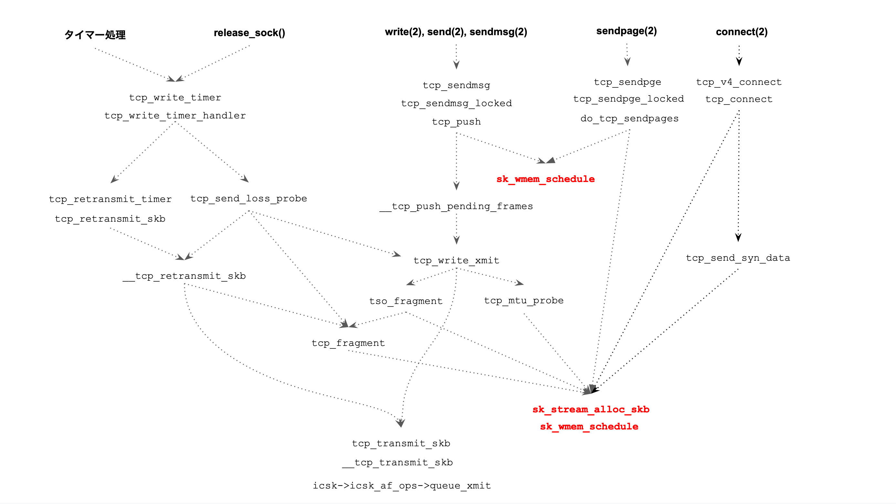
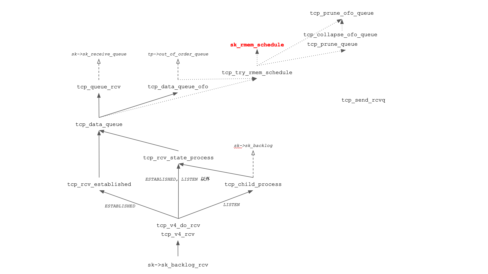
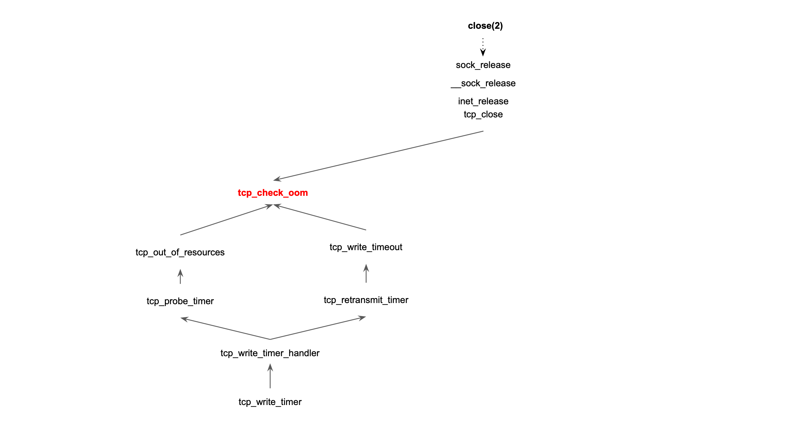

本文は https://tech.pepabo.com/2020/06/26/kernel-dive-tcp_mem/ の補助資料として書き出したものになります。一部、力尽きて調べきれなかったものもありますが、ご了承ください

# memory pressure モード

Linux カーネル は、 TCP メモリクォータ ( tcp_memory_allocated ) が ソフトリミット ( `net.ipv4.tcp_mem[2]` )  を超過し、TCP memory pressure モードに入ると以下の処理を行います。

 * TCP ソケットの送信バッファのサイズを制限する
 * TCP ソケットの受信バッファ大サイズを制限する
 * TCP ソケットの受信ウィンドウサイズを拡張しない (ウィンドウをオープンしない)
 * 受信キュー ( シーケンス番号順に受信した ACK を返したセグメント保持し、ユーザ空間へのコピーを待つキュー) から重複したシーケンス番号をマージして、空きメモリを確保する。 ( collapse 処理 )
 * Ouf of Order キュー ( シーケンス番号順に受信しなかったセグメントを保持するキュー ) に入ったセグメントを破棄 (DROP) する
 * 受信スロースタート閾値を制限する

memory pressure モードを抜けると、これらの処理は止まります。

## memory pressure モードの範囲

memory pressure モードは、システム全体に作用するモードです。つまり、namespace を問わず、全てのプロセスの、全ての TCP ソケットに対して作用します。TCP ソケットを扱うユーザが、一般ユーザか、特権ユーザかも問いません。

memory pressure モードは cgroup でも実装されています。 😔

## memory pressure モードと送受信のスループット

memory pressure モードは、TCP のデータ送信・受信のパフォーマンス低下を招きます。

先に記したように、TCP ソケットの送信バッファ・受信バッファのサイズが制限されるこため、送信できるセグメント数と受信できるセグメント数(ウィンドウサイズ) に制限がかかり、スループットの低下を招くでしょう。 

また、受信キューや Ouf of Order キューに入ったセグメントを破棄 (DROP) すると、送信側ホストのセグメント再送処理を待つことになり、受信処理のスループットが低下するでしょう。

受信キューや Ouf of Order キューに入ったセグメントをマージして、空きメモリを確保する処理 ( collapse 処理 ) は、キュー内のセグメントを走査し、シーケンス番号を比較する処理をするため、セグメントの受信 = SoftIRQ コンテキストでの CPU 時間の増加が考えれます。

以上から、memory pressure モードは一時的にシステム全体の TCP の送信・受信のパフォーマンスを犠牲にすることで、メモリが逼迫した状況を回復しようとする仕組みと、私は理解しています。

## memory pressure モードに関わる処理

memory pressure モードに関わるソースを列挙します。Linux カーネルのソースを追うことに興味がない場合は読み飛ばしていただいて構いません。

### memory pressure モードに入る関数

[sk_enter_memory_pressure](https://elixir.bootlin.com/linux/v5.0.21/source/net/core/sock.c#L2173) を呼び出し、TCP ソケットの場合は [tcp_enter_memory_pressure](https://elixir.bootlin.com/linux/v5.0.21/source/net/ipv4/tcp.c#L324) を呼び出します。
 
### memory pressure モードを脱ける関数

[sk_leave_memory_pressure](https://elixir.bootlin.com/linux/v5.0.21/source/net/core/sock.c#L2181) を呼び出し、TCP ソケットの場合は [tcp_leave_memory_pressure](https://elixir.bootlin.com/linux/v5.0.21/source/net/ipv4/tcp.c#L339) を呼び出します。

### memory pressure モードを判定する関数

以下の２つの関数で行います。

* [sk_under_memory_pressure](https://elixir.bootlin.com/linux/v4.15/source/include/net/sock.h#L1194)
* [tcp_under_memory_pressure](https://elixir.bootlin.com/linux/v4.15/source/include/net/tcp.h#L254)

### 📝 cgroup の memory  pressure モード

cgroup でも memory pressure モードが存在します。

sk_under_memory_pressure では cgroup ごとの memory pressure モードの判定も行っています。

mem_cgroup_charge_skmem で チャージできなかった場合に memory pressure モードに入ります。

 * sk_forced_mem_schedule
 *  __sk_mem_raise_allocated

TCP クォータとソフトリミット・ハードリミットを比較するのでなく、cgroup 内のメモリ使用量 ( charge ) に応じて判定を下すようです。詳しくは mem_cgroup_charge_skmem の実装を見ていただくのがyいかと思います。

##  memory pressure モードでの TCP 送信処理

Linux カーネルは、 memory pressure モードの時、セグメントを送信する際に以下の処理を行います。

 * 送信バッファのサイズを制限する
 * メモリクォータを回収する

memory pressure モードでふるまいを変える関数を説明していきます。

### [sk_stream_moderate_sndbuf](https://elixir.bootlin.com/linux/v4.15/source/include/net/sock.h#L2122)

sk_stream_moderate_sndbuf は、TCP ソケットの送信バッファの最大サイズ ( sk->sk_sndbuf ) を減らす関数です。最大サイズは、関数呼び出し時の送信バッファのメモリ使用量 ( sk->sk_wmem_queued ) か 、 SOCK_MIN_SNDBUF 定数 ( 実験環境では 4608 bytes ) の小さい方に切り詰められます。 

もし、setsockopt(2) + SO_SNDBUF で送信バッファの最大サイズを設定している場合は何も処理をしません。

TCP は、送信したデータが受信側に届き、受信側からの ACK 受けてから、送信バッファのセグメンを解放します。送信バッファサイズが制限されている場合、

### [sk_stream_alloc_skb -> sk_mem_reclaim_partial](https://elixir.bootlin.com/linux/v5.0.21/source/net/ipv4/tcp.c#L863)

[sk_stream_alloc_skb](https://elixir.bootlin.com/linux/v5.0.21/source/net/ipv4/tcp.c#L863)  は セグメント送信の際に [struct sk_buff](https://elixir.bootlin.com/linux/v5.0.21/source/include/linux/skbuff.h#L672) を割り当てる関数です。 

struct sk_buff は、 Linux カーネルのネットワークスタックでの送信・受信データを扱う構造体で、 **ソケットバッファ** と呼ばれています。ソケットバッファは、利用するプロトコルを問わず汎用的にデータを扱えるように設計されています。TCP の場合は、TCP ヘッダとTCP ペイロード、IP ヘッダ、Ethernet ヘッダを保持する構造体となります。抽象的な見方では、Linux のネットワークレイヤを上下に往来する「パケット」を表現している構造体とみなせます。 

Linux カーネルは、 memory pressure モードで、sk_stream_alloc_skb の中で [sk_mem_reclaim_partial](https://elixir.bootlin.com/linux/v5.0.21/source/include/net/sock.h#L1431) を呼び出します。 sk_mem_reclaim_partial は、ソケットメモリクォータを減らし、TCP メモリクォータに返却します。ソケットメモリクォータを減らすと、TCP ソケットが送信バッファ・受信バッファに割り当るメモリを減らす制限となります。

### [tcp_send_fin](https://elixir.bootlin.com/linux/v5.0.21/source/net/ipv4/tcp_output.c#L3090)

tcp_send_fin は、パッシブクローズ、あるいは、アクティブクローズで FIN を送信する関数です。

memory pressure モードの時、カーネルは FIN を送る際に 再送信キュー ( sk->tcp_rtx_queue) ) の末尾からセグメントを取り出し FIN フラグのセットを試みます。新たに  alloc_skb_fclone での struct sk_buff の割り当てを控えて、セグメントの送信数を減らすための最適化と思われます。

## memory pressure モードでの TCP 受信処理

カーネルは、 memory pressure モードでセグメントを受信する際に、以下の処理を行います。

* ウィンドウサイズの制限
* Out of Order キューに入ったセグメントの破棄 (DROP)
* 受信スロースタート閾値の調整

memory pressure モードで処理を変える関数を説明していきます。Linux カーネルのソースを追うことに興味がない場合は読み飛ばしていただいて構いません。

### [tcp_grow_window](https://elixir.bootlin.com/linux/v4.15/source/net/ipv4/tcp_input.c#L369)

tcp_grow_window は、データを受信したタイミングで、受信スロースタート閾値 (tp->rcv_ssthresh) を増やす関数です。memory pressure モードでは、受信スロースタート閾値を増やしません。

#### 📝 受信スロースタート閾値 について

*スロースタート閾値* は、 **送信側** が輻輳回避をする際に閾値であると、TCP を解説するドキュメントや書籍で説明されています。Linux カーネルのソースでは **tp->snd_ssthresh** ( tp は struct tcp_sock ) として定義されています。

ここに記ししている  *受信スロースタート閾値* ( tp->rcv_ssthresh) は、受信側でスロースタートをコントロールするために Linux カーネルが導入した閾値です。

Buffer Bloat なセグメント = ヘッダに対してデータサイズが小さい (128バイト以下) のセグメントを大量に受信して ... な事態を避けるための閾値として作用します。

### [tcp_clamp_window](https://elixir.bootlin.com/linux/v4.15/source/net/ipv4/tcp_input.c#L456)

tcp_clamp_window は、受信バッファのサイズ ( sk->sk_rcvbuf ) と受信スロースタート閾値 ( tp->rcv_ssthresh ) を調整する関数です。

Linux カーネルは、以下の条件が満たされていた場合に受信バッファのサイズを最大で net.ipv4.sysctl_tcp_rmem[2] まで増やします。

 * 該当のソケットの受信バッファのサイズが net.ipv4.sysctl_tcp_**r**mem[2] より小さいこと 
 * 該当のソケットの受信バッファのサイズが setsockopt(2) + SO_RCVBUF で設定(固定)されていないこと
 *  **memory pressure モードでないこと**
 * `tcp_memory_allocated < net.ipv4.tcp_mem[0]` であること

memory pressure モードの時、カーネルは 受信バッファのサイズを増やしません。

### [tcp_prune_ofo_queue](https://elixir.bootlin.com/linux/v5.0.21/source/net/ipv4/tcp_input.c#L5035)

tcp_prune_ofo_queue は、 **Out of Order キュー** に入ったセグメントを破棄する処理です。

Ouf of Order キューは、シーケンス番号順に受信できなかったセグメントを保持しておくキューです。 ( [赤黒木](https://lwn.net/Articles/184495/) で実装されています) 。処理中の TCP コネクションが、SACK オプションをサポートしている場合、キューに入ったセグメントで SACK / DSACK ?

tcp_prune_ofo_queue は、シーケンス番号の大きい順に Ouf of Order キューのセグメントを [破棄 (tcp_drop)](https://elixir.bootlin.com/linux/v5.0.21/source/net/ipv4/tcp_input.c#L5031) するループを回します。同時に、sk_mem_reclaim を呼び出しソケットメモリプールから TCP メモリプールにクォータを返却します。以上の処理は、memory pressure モードを脱するか、Ouf of Order キューが空になるまでパケットの破棄を続きます。

SACK するセグメントが受信側(サーバ) で破棄されるため、送信側(クライアント) でセグメント再送処理が必要となります。送受信のスループット低下や、再送セグメントによる帯域増加が考えられます。

#### 📝 SACK Regene について

SACK 済みの受信セグメントを破棄 (DROP) する処理は、RFC 2018 TCP Selecive Acknowledgment Options に記載された [8. Data Receiver Reneging](https://tools.ietf.org/html/rfc2018#section-8) に該当する処理です。 Linuxカーネル2.6 解読室 では **SACK regene** と表記されています。

### [tcp_should_expand_sndbuf]()

TCP ソケットの送信バッファのサイズ (sk->sk_sndbuf) を、増やせるかどうかを判定する関数です。memory pressure モードでは、サイズを増やせません。

この関数は、同時に以下の条件もテストします。

 * 該当ソケットの送信バッファのサイズが、 setsockopt(2) + SO_SNDBUF で固定されているか
 * `tcp_memory_allocated >= net.ipv4.tcp_mem[0]` かどうか 
 * 送信済みのパケット( `in_flight` ) が輻輳ウィンドウサイズを超えているか
    * [tcp_packets_in_flight ](https://elixir.bootlin.com/linux/v5.0.21/ident/tcp_packets_in_flight) を参照してください。

tcp_shouldexpand_sndbuf は、セグメントや ACK の受信途中で呼び出されます。送信バッファが制限されていると、送信ウィンドウを拡大できず、送信スループットが頭打ちになる状態を招くと思われます。

### [tcp_prune_queue](https://elixir.bootlin.com/linux/v4.15/source/net/ipv4/tcp_input.c#L4910)

tcp_prune_queue は以下の処理を行います。

 1. Ouf of Order キューと受信キューの collapse 処理 を行う
 2.  1 で、空きメモリが確保できない場合は、tcp_prune_ofo_queue で Ouf of Order キューのセグメントを破棄する。

memory pressure モードでは、受信スロースタート閾値 (tp->rcv_ssthresh) を、現在の閾値か、Advertised MSS の4倍かの小さい方の値にセットします。

#### 📝 受信スロースタート閾値について

TCP/IP を解説する本で、  **スロースタート閾値** は送信側の輻輳制御の閾値として説明されています。Linux Kernel では受信側でも制御できるスロースタートの仕組みを実装しています。

**Bloated Segment** (ヘッダに対してペイロードが小さな TCP セグメント) を大量に受信してアプリケーションでのセグメント処理が追いつかない場合、受信バッファが TCP ペイロードよりも TCP ヘッダのサイズが大きな割合を占めて埋まってしまいます。受信バッファが埋まると、 tcp_prune_queue を実行する必要がでるため (?) ... 

```c

 * rcv_ssthresh is more strict window_clamp used at "slow start"
 * phase to predict further behaviour of this connection.
 * It is used for two goals:
 * - to enforce header prediction at sender, even when application
 *   requires some significant "application buffer". It is check #1.
 * - to prevent pruning of receive queue because of misprediction
 *   of receiver window. Check #2.
 *

 ...

 static int __tcp_grow_window(const struct sock *sk, const struct sk_buff *skb)
```

それを避けるために rcv_ssthresh と window_clamp を設けているそうです。詳しい解説はこのエントリの範疇を超えてしまうので ... や ... を参照してください

 sk->rcv_ssthresh が減ることで __tcp_grow_window で

```c
 	//    free spece
	//        |
	//        v
	// [---+--+++++++++++++][                 ]
	//     ^               ^                  ^
	//     |               |                  |
	//   rcv_ssthresh   full space       tp->sk_rcvbuf
```

### [__tcp_select_window](https://elixir.bootlin.com/linux/v4.15/source/net/ipv4/tcp_output.c#L2612)

__tcp_select_window は、送信側に 広告 (Advertise) するウィンドウサイズを計算する際に呼び出されます。

memory pressure モードでは、 受信スロースタート閾値 (tp->rcv_ssthresh) を、現在の閾か MSS の4倍かの小さい値で再設定します。 (受信スロースタート閾値については tcp_prune_queue の項目を参照してください)

### [tcp_delack_timer_handler](https://elixir.bootlin.com/linux/v5.0.21/source/net/ipv4/tcp_timer.c#L309)

tcp_delack_timer_handler は、遅延 ACK (delayed ACK) のタイマー処理をする関数です。

memory pressure モードの時は、タイマー処理の最後で [sk_mem_reclaim](https://elixir.bootlin.com/linux/v5.0.21/source/include/net/sock.h#L1423) を呼び出します。 sk_mem_reclaim は、ソケットのメモリプールの空き ( sk->sk_forward_alloc ) を全て TCP メモリプールへ返却します。

ソケットメモリープルが減ることで、送信バッファ・受信バッファに割り当てられるメモリも減るため、送信・受信でバッファリングできるセグメントにも制限され、パフォーマンス低下を招くと考えられます。

# ハードリミットの処理

tcp_memory_allocated > net.ipv4.tcp_mem[2] を確認しているコードは以下の２つです

 * [__sk_mem_raise_allocated](https://elixir.bootlin.com/linux/v5.0.21/source/net/core/sock.c#L2342)
 * [tcp_out_of_memory](https://elixir.bootlin.com/linux/v5.0.21/source/include/net/tcp.h#L281)

## __sk_mem_raise_allocated

1️⃣ 2️⃣ 3️⃣ で memory_allocated と net.ipv4.tcp_mem の min, pressure, max をそれぞれ比較しています.

```c
int __sk_mem_raise_allocated(struct sock *sk, int size, int amt, int kind)
{
 　...

	/* Under limit. */
	if (allocated <= sk_prot_mem_limits(sk, 0)) { 1️⃣
		sk_leave_memory_pressure(sk); // memory pressure モードを脱ける
		return 1;
	}

	/* Under pressure. */
	if (allocated > sk_prot_mem_limits(sk, 1)) 2️⃣
		sk_enter_memory_pressure(sk); // memory pressure モードに入る

	/* Over hard limit. */
	if (allocated > sk_prot_mem_limits(sk, 2)) 3️⃣
		goto suppress_allocation;
```

この関数は 

 * 0 を返す場合、 TCP のメモリ割り当てが行われる。
 * 1 を返す場合、 TCP のメモリ割り当ては行われず、呼び出し元の関数はエラーハンドリングを行う

戦略は以下の通り

 * 1. TCP 全体のページ数と net.ipv4.tcp_mem の比較して余地があるかどうか
 * 2. ソケット単体のメモリ使用量 (sk->rmem_alloc あるいは sk->wmem_alloc) と net.ipv4.tcp_rmem, wmem の比較してメモリ割り当ての余地があるかどうか

の ステップに分けてメモリの割り当てが可能かどうかを見ている。

3️⃣ で max = ハードリミットを超えていた場合は、goto でジャンプし、suppress_allocation: の処理に続く。

#### suppress_allocation:

もし、扱っているバッファが 送信バッファの場合は、4️⃣ で 送信バッファサイズ (sk->sk_sndbuf) を減らして空きが確保できるかを試み、それでもなら最終的に 5️⃣ で 0 を返します

```c
suppress_allocation:

	if (kind == SK_MEM_SEND && sk->sk_type == SOCK_STREAM) {
		sk_stream_moderate_sndbuf(sk); 4️⃣

		/* Fail only if socket is _under_ its sndbuf.
		 * In this case we cannot block, so that we have to fail.
		 */
		if (sk->sk_wmem_queued + size >= sk->sk_sndbuf)
			return 1;
	}

  ...

	return 0; 5️⃣
```

__sk_mem_raise_allocated の呼び出し元をたどると

 * sk_rmem_schedule
 * sk_wmem_schedule

「max = ハードリミットを超えた場合 -> __sk_mem_raise_allocated が 0 を返した場合 -> sk_*_schedule が 0 を返した場合」を見て行くと、どのような箇所に影響を及ぼすかを辿っていくことができる

## ハードリミットを超えた時の影響

TCP メモリクォータがハードリミットを超えた場合、送信処理と受信処理でどのような影響がでるかをソースを併記して見ていきます。

### 送信処理への影響

ハードリミットを超えた時、TCP ソケットの送信処理にどのような影響がでるかを見ていきます。

### 送信ソケットのクォータ獲得 - sk_wmem_schedule



sk_wmem_schedule は、TCP ソケットプールあるいはTCP メモリプール に空きがあるかを確認して、空きがあればソケットクォータを増やす関数です。

もし、TCP メモリクォータ (tcp_memory_allocated) がハードリミットを超えていた場合は、TCP ソケットクォータは増やせず、sk_wmem_schedule は false を返します。

sk_mem_schedule は、以下の送信処理で呼び出されます。

 * do_tcp_sendpages
 * tcp_sendmsg_locked
 * sk_stream_alloc_skb 

sk_stream_alloc_skb は、さらに複数の箇所で呼び出されます。

### tcp_sendmsg_locked  - write(2), sendmsg(2) 等のシステムコール呼び出し

プロセスが TCP ソケットのファイルデスクリプタに対して write(2), sendmsg(2), send(2) を呼び出すと、VFS レイヤ -> BSD ソケットレイヤを経て、TCP レイヤの tcp_sendmsg_locked 呼び出しにつながります。

ハードリミットを超えている場合、tcp_sendmsg_locked の sk_wmem_schedule が false となり、`wait_for_memory:` の処理に飛びます。

 * tcp_push で 送信キュー ( sk->write_queue ) にソケットバッファがあれば、送信を試みる
 * sk_stream_wait_memory でブロックする

```c
int tcp_sendmsg_locked(struct sock *sk, struct msghdr *msg, size_t size)
{

...

			if (!sk_wmem_schedule(sk, copy)) 🔥
				goto wait_for_memory;


wait_for_memory:
		tcp_push(sk, flags & ~MSG_MORE, mss_now,
			 TCP_NAGLE_PUSH, size_goal);

		err = sk_stream_wait_memory(sk, &timeo);
		if (err != 0)
			goto do_error;

		mss_now = tcp_send_mss(sk, &size_goal, flags);
	}
```

2️⃣ の sk_stream_wait_memory、送信バッファのメモリが確保できるかタイムアウトまでプロセスをブロック (TASK_INTERRUPTIBLE) する処理です。ノンブロッキングなソケットの場合は、ブロックせずに -EAGAIN を返します。 

タイムアウトの時間は、 setsockopt(2) + SO_SNDTIMEO で設定していれば、その値を用います。タイムアウトの時間を設定していない場合は、ランダムな時間 ( `(prandom_u32() % (HZ / 5)) + 2` )になるようです 。

* tcp_push -> __tcp_push_pending_frames -> tcp_write_xmit -> tcp_mtu_probe -> sk_stream_alloc_skb
* tcp_write_xmit

というパスでハードリミットの

tcp_sendmsg_locked は、プロセスが sendmsg(2) や を呼んでデータ送信する際に呼び出されます。 

### do_tcp_sendpages の呼び出し

```c
ssize_t do_tcp_sendpages(struct sock *sk, struct page *page, int offset,
			 size_t size, int flags)
{

...

		if (!sk_wmem_schedule(sk, copy)) 🔥
			goto wait_for_memory;

...

wait_for_memory:
		tcp_push(sk, flags & ~MSG_MORE, mss_now,
			 TCP_NAGLE_PUSH, size_goal);

		err = sk_stream_wait_memory(sk, &timeo);
		if (err != 0)
```

tcp_write_xmit の途中で呼び出されます。

2️⃣ の sk_stream_wait_memory、送信バッファのメモリが確保できるかタイムアウトまでプロセスをブロック (TASK_INTERRUPTIBLE) する処理です。ノンブロッキングなソケットの場合は、ブロックせずに -EAGAIN を返します。 

### sk_stream_alloc_skb

sk_stream_alloc_skb は、ソケットバッファ (struct sk_buff) を割り当てる関数です。

ハードリミットを超えていると、sk_wmem_schedule が false を返し、ソケットバッファの割り当てに失敗したとして NULL を返します。

```c
struct sk_buff *sk_stream_alloc_skb(struct sock *sk, int size, gfp_t gfp,
				    bool force_schedule)
{
...

　　/* ソケットバッファの割り当て */
	skb = alloc_skb_fclone(size + sk->sk_prot->max_header, gfp);
	if (likely(skb)) {
	
...

			mem_scheduled = sk_wmem_schedule(sk, skb->truesize); 🔥
...			

		if (likely(mem_scheduled)) {
		    /* sk_wmem_schedule() が true の場合は skb を返す  */
...
	    			return skb;
		}
		
		/* sk_wmem_schedule() が false の場合、バッファを解放して、 NULL を返す */
		__kfree_skb(skb);
		
	}
	return NULL;		
```

sk_stream_alloc_skb は、送信処理では以下の関数で呼び出されます。

* do_tcp_sendpages
* tcp_fragment
* tso_fragment
* tcp_mtu_probe
* tcp_send_syn_data
* tcp_connect

これらの関数で sk_stream_alloc_skb が失敗した場合、送信処理にどのような影響が出るかをソースと併記してみていきます。

## sk_stream_alloc_skb と connect(2) 実行のパス

connect(2) を呼び出すパスでは、以下の関数が sk_stream_alloc_skb を呼び出します。

* tcp_connect 
* tcp_send_syn_data

#### tcp_connect

tcp_connect は、プロセスが connect(2) システムコールを呼び出して、3-way-handshake の　SYN を送る際の関数です。

```c
/* Build a SYN and send it off. */
int tcp_connect(struct sock *sk)

...

	buff = sk_stream_alloc_skb(sk, 0, sk->sk_allocation, true); 🔥
	if (unlikely(!buff))
		return -ENOBUFS;
```

tcp_connect は、 sk_stream_alloc_skb が エラー (NULL) を返した場合に、 **-ENOBUS** を返します。したがって、connect(2) システムコールを呼び出したプロセスは、ENOBUFS を errno として受け取ります。 

### tcp_send_syn_data

tcp_send_syn_data は、setsockopt(2) + TCP_FASTOPEN を設定したソケットで、TCP Fast Open を試みる関数です。

```c
static int tcp_send_syn_data(struct sock *sk, struct sk_buff *syn)
{
...
	syn_data = sk_stream_alloc_skb(sk, space, sk->sk_allocation, false); 🔥
	if (!syn_data)
		goto fallback;
		
...

fallback:
	/* Send a regular SYN with Fast Open cookie request option */
	if (fo->cookie.len > 0)
		fo->cookie.len = 0;
	err = tcp_transmit_skb(sk, syn, 1, sk->sk_allocation); /* 通常の SYN 送信 */
	
...	
```

tcp_send_syn_data は、sk_stream_alloc_skb  が エラー(NULL) を返す場合、TCP Fast Open を諦め、通常の SYN 送信にフォールバックします。

## sk_stream_alloc_skb と  タイマー処理のパス

次んい、タイマー処理のパスで、ハードリミットを超えた場合の影響を見ていきます。まず、Linux カーネルのTCP 実装には、以下のタイマー処理が存在します。

 * セグメント再送タイマー ( tcp_retransmit_timer )
 * 遅延 ACK タイマー ( tcp_delack_timer_handler )  
 * ゼロウィンドウ Probe タイマー
 * loss probe タイマー
 * キープアライブタイマー

このうち、TCP メモリクォータのハードリミットが影響するのは、以下の二つです

 * 再送タイマー
 * send_loss_prbe

### 再送タイマー - tcp_retransmit_timer

tcp_retransmit_timer は、セグメント再送タイマーの実装です。TCP メモリクォータがハードリミットを超えていると、 tcp_retransmit_skb() が ENOMEM で失敗します。

```c
void tcp_retransmit_timer(struct sock *sk)
{

...

	icsk->icsk_retransmits++;
	if (tcp_retransmit_skb(sk, tcp_rtx_queue_head(sk), 1) > 0) { 🔥
		/* Retransmission failed because of local congestion,
		 * Let senders fight for local resources conservatively.
		 */
		inet_csk_reset_xmit_timer(sk, ICSK_TIME_RETRANS,
					  TCP_RESOURCE_PROBE_INTERVAL,
					  TCP_RTO_MAX);
		goto out;
	}

...
```

ハードリミットを原因として、tcp_retransmit_skb が失敗するのは、 __tcp_retransmit_skb -> tcp_fragment -> sk_stream_alloc_skb  と呼び出すケースなので、 TCP セグメントのフラグメント処理をするのに限られます。

```c
int __tcp_retransmit_skb(struct sock *sk, struct sk_buff *skb, int segs)
{

...

	if (skb->len > len) {
		if (tcp_fragment(sk, TCP_FRAG_IN_RTX_QUEUE, skb, len,
				 cur_mss, GFP_ATOMIC))
			return -ENOMEM; /* We'll try again later. */
```

### loss probe タイマー - tcp_send_loss_probe

loss probe タイマーは、受信側が 0 Window をした際に、デッドロックを避ける目的で送られる ... です。

ハードリミットを超えている場合、tcp_send_loss_probe の以下の関数がエラーになりえます。

 * tcp_write_xmit
 * tcp_fragment
 *  __tcp_retransmit_skb 

```c
void tcp_send_loss_probe(struct sock *sk)
{

...
		tcp_write_xmit(sk, mss, TCP_NAGLE_OFF, 2, GFP_ATOMIC); 🔥
		if (tp->packets_out > pcount)
			goto probe_sent;
		goto rearm_timer;

...

	if ((pcount > 1) && (skb->len > (pcount - 1) * mss)) {
		if (unlikely(tcp_fragment(sk, TCP_FRAG_IN_RTX_QUEUE, skb, 🔥
					  (pcount - 1) * mss, mss,
					  GFP_ATOMIC)))
			goto rearm_timer;

...
 
	if (__tcp_retransmit_skb(sk, skb, 1)) 🔥
		goto rearm_timer;

...

rearm_timer:
	tcp_rearm_rto(sk); 👈
}
```

いずれの処理でもエラーとなった場合、probe の送信を諦めて、tcp_rearm_rto でタイマーを再度設定する処理に移ります。

----

次に、プロセスが TCP ソケットのファイルデスクリプタに対して write(2), sendmsg(2), send(2) を呼び出した際に、ハードリミットの


### 7-2-1.4: tcp_mtu_probe

```c
static int tcp_mtu_probe(struct sock *sk)
{
...

	/* We're allowed to probe.  Build it now. */
	nskb = sk_stream_alloc_skb(sk, probe_size, GFP_ATOMIC, false);
	if (!nskb)
		return -1;

```

tcp_write_xmit


# ハードリミットを超えた時の受信処理

ハードリミットを超えた時、TCP ソケットの受信処理にどのような影響がでるかをソースを併記して見ていきます。

### 受信ソケットのクォータ獲得 - sk_rmem_schedule



sk_rmem_schedule  自体は TCP 以外のプロトコルでも利用する汎用的な関数です。TCP では、後述する tcp_try_rmem_schedule 一箇所のみで呼び出されます。

### ハードリミットの確認 - tcp_try_rmem_schedule

tcp_try_rmem_schedule は、セグメント受信処理の際に呼び出され、ソケットクォータと TCP メモリクォータを見てメモリを割り当てできるかどうかを判定します。

ただ単にハードリミットの確認だけする関数ではなく、tcp_prune_queue と  tcp_prune_ofo_queue でメモリの回収処理も入っており、複雑な処理になっています。

```c
static int tcp_try_rmem_schedule(struct sock *sk, struct sk_buff *skb,
				 unsigned int size)
{
	if (atomic_read(&sk->sk_rmem_alloc) > sk->sk_rcvbuf || 1️⃣
	    !sk_rmem_schedule(sk, skb, size)) {

		if (tcp_prune_queue(sk) < 0) 2️⃣
			return -1;

		while (!sk_rmem_schedule(sk, skb, size)) { 3️⃣
			if (!tcp_prune_ofo_queue(sk))
				return -1; 4️⃣
		}
	}
	return 0;
}
```

* 1️⃣ 二つの関数を OR 条件で見ています
	* ソケットの受信バッファのメモリ使用量が、受信バッファのサイズを超えていないか 
   * ハードリミットを超えていないか
* 2️⃣ tcp_prune_queue でメモリの解放を試みます
* 3️⃣ ハードリミットを下回るまで  tcp_prune_ofo_queue を試みます
* 4️⃣ tcp_prune_ofo_queue() を繰り返してもハードリミットを超えている場合は、 -1 を返します

tcp_try_rmem_schedule は以下の処理で呼び出されます。

 * tcp_data_queue
 * tcp_data_queue_ofo 

tcp_send_rcvq という関数でも tcp_try_rmem_schedule が呼び出されますが、 TCP connection repair ( `CRIU - Checkpoint/Restore In Userspace` の実装に使われている?)  特殊な用途のため割愛します。

### tcp_data_queue

tcp_data_queue は、セグメントを受信する際に呼び出されます。

新たに受信したセグメントのシーケンス番号が、次に受信すべきシーケンス番号 (tp->rcv_nxt) と合致していれば、受信キュー ( sk->sk_receive_queue ) にセグメントを入れます。

受信キューにセグメントが入ると カーネルは ACK / Delayed ACK を返します。また、プロセスが recvmsg(2) 等のシステムコールで、カーネル空間からユーザ空間にデータ( TCP ペイロード) をコピーできる状態になります。

#### ハードリミットを超えている場合

tcp_data_queue は、先に書いた tcp_try_rmem_schedule を呼び出して、ハードリミットを超えているかどうかを確認します。

```c
static void tcp_data_queue(struct sock *sk, struct sk_buff *skb)
{

		if (TCP_SKB_CB(skb)->seq == tp->rcv_nxt) {

...

		/* Ok. In sequence. In window. */
queue_and_out:
		if (skb_queue_len(&sk->sk_receive_queue) == 0)
			sk_forced_mem_schedule(sk, skb->truesize);
		else if (tcp_try_rmem_schedule(sk, skb, skb->truesize)) { 🔥
			NET_INC_STATS(sock_net(sk), LINUX_MIB_TCPRCVQDROP);
			goto drop;
		}
		
		/* ハードリミットを超えてないなら受信キューに入れる */
		eaten = tcp_queue_rcv(sk, skb, &fragstolen)

...

drop:
		tcp_drop(sk, skb); /* ドロップ +/
		return;
	}
				
```

🔥 もし、ハードリミットを超えている場合は、 `goto drop` に飛び、受信キューに入れず(ACK を返さず)、セグメント(パケット) をドロップします。

### tcp_data_queue_ofo

tcp_data_queue_ofo は、受信したセグメントが、シーケンス番号通りでなかった場合に、 OfO = Ouf of Order キューにセグメントを繋ぐ処理です。TCP は、順番通りにセグメントを受け取れることを保証していますが、 Ouf of Order キューが担います。

tcp_data_queue_ofo  は、tcp_data_queue と同様に、tcp_try_rmem_schedule を呼び出してハードリミットを超えていないかどうかを確認します。

```c
static void tcp_data_queue_ofo(struct sock *sk, struct sk_buff *skb)
{

...

	if (unlikely(tcp_try_rmem_schedule(sk, skb, skb->truesize))) { 🔥
		NET_INC_STATS(sock_net(sk), LINUX_MIB_TCPOFODROP);
		tcp_drop(sk, skb);
		return;
	}
	
...	
```

ハードリミットを超えていた場合は、 tcp_drop でセグメント (パケット) を破棄(ドロップ) します。

----

Linux Kernel は TCP の受信処理で メモリの割り当てができない場合は キューのデータを削除する、もしくは、新規に受信したデータを DROP することで メモリの不足している状況を回復しようとします. いずれの操作も送信側のサーバーにセグメントの再送を促すことになるため、スループットの低下を招くでしょう。

## TCP: out of memory -- consider tuning tcp_mem を出す条件は?

`TCP: out of memory -- consider tuning tcp_mem` は、tcp_check_oom ()で出力されます。

```c
bool tcp_check_oom(struct sock *sk, int shift)
{
	bool too_many_orphans, out_of_socket_memory;

	too_many_orphans = tcp_too_many_orphans(sk, shift);
	out_of_socket_memory = tcp_out_of_memory(sk); 1️⃣

	if (too_many_orphans)
		net_info_ratelimited("too many orphaned sockets\n");
	if (out_of_socket_memory) 1️⃣
		net_info_ratelimited("out of memory -- consider tuning tcp_mem\n"); 2️⃣
	return too_many_orphans || out_of_socket_memory;
}
```

* 1️⃣ tcp_out_of_memory() が真を返すと 
* 2️⃣ dmesg のログを出力します

📝 `too many orphaned sockets` が気になることころですが、傍に置いておきます。  `sysctl net.ipv4.tcp_max_orphans` に関連するエラーメッセージです。

1️⃣ の条件は以下の通りです

```c
static inline bool tcp_out_of_memory(struct sock *sk)
{
	if (sk->sk_wmem_queued > SOCK_MIN_SNDBUF &&
	    sk_memory_allocated(sk) > sk_prot_mem_limits(sk, 2))
		return true;
	return false;
}
```

## tcp_out_of_memory

### 条件1. sk->sk_wmem_queued > SOCK_MIN_SNDBUF

[sk->sk_wmem_queued](https://elixir.bootlin.com/linux/v4.15/source/include/net/sock.h#L252) は 「ソケットの送信バッファにキューイングされたが、まだ送信してない (下位のIPレイヤ、デバイスドライバ、NIC で未処理) あるいは送信済みだが ACK を受け取ってないデータの量」を指します. 単位はバイトです

> sk_wmem_queued is the amount of memory used by the socket send buffer queued in the transmit queue and are either not yet sent out or not yet acknowledged.
>
> https://unix.stackexchange.com/questions/33855/kernel-socket-structure-and-tcp-diag

[ss の man](http://man7.org/linux/man-pages/man8/ss.8.html) では「パケットを送るために割り当てたメモリの量 (まだ L3 に送られていない)」と書いてあります

> <wmem_queued>
>   The memory allocated for sending packet (which has not been sent to layer 3)

wmem_queued は 送信キュー ( sk->sk_write_queue ) はあるいは再送信キュー ( sk->tcp_rtx_queue ) に入った skb->truesize を計上してます ( )

#### 📝 sk->sk_wmem_queued は ss コマンドで確認できます

```
vagrant@proxy000:~$ ss -mt
State          Recv-Q            Send-Q                          Local Address:Port                           Peer Address:Port
ESTAB          0                 4344                          192.168.100.100:8888                          192.168.100.1:55324
         skmem:(r0,rb374400,t0,tb4608,f1688,w6504,o0,bl0,d0) 👈
```

`sk->sk_wmem_queued` は 👈 で指す `w6504` の数値になります.

( その他の項目は man を読むか、[ss のソース](https://github.com/sivasankariit/iproute2/blob/master/misc/ss.c#L1343) と Linux カーネルのソースを付き合わせて確認してください )

SOCK_MIN_SNDBUF のサイズは `net/sock.h` で定義されています

```c
#define TCP_SKB_MIN_TRUESIZE	(2048 + SKB_DATA_ALIGN(sizeof(struct sk_buff)))

#define SOCK_MIN_SNDBUF		(TCP_SKB_MIN_TRUESIZE * 2) 👈
```

今回の実験環境では SOCK_MIN_SNDBUF は 4608 でした (定数を dmesg に pr_info するだけのカーネルモジュールを書いて確認 )

### 条件2: sk_memory_allocated(sk) > sk_prot_mem_limits(sk, 2))

この条件式は、それぞれの関数を展開していくと以下の条件式と等しくなります

```
tcp_memory_allocated > net.ipv4.tcp_mem[2]
```

`max: TCP memory_allocated > net.ipv4.tcp_mem[2]` であり、 これまでに説明を書いてきたので割愛します。

## tcp_check_oom() が呼び出される場所は?



tcp_check_oom が呼び出されるのは以下の二箇所だけです

 * [tcp_close](https://elixir.bootlin.com/linux/v4.15/source/net/ipv4/tcp.c#L2149)
 * [tcp_out_of_resources](https://elixir.bootlin.com/linux/v4.15/source/net/ipv4/tcp_timer.c#L65)

前者はソケットがクローズする際に呼び出されます。後者はタイマー処理で呼び出されます。

### tcp_close()

TCP ソケットが、クローズされる際に呼び出される処理です。例えば、close(2) を呼び出した場合に呼び出されます。 ( close(2) 以外でも tcp_close() が呼び出されるパスはありますが、ソケット作成時のエラー処理で呼び出されており、TCP oom とは関係はないものと思われます。 )

tcp_close() が tcp_check_oom() を呼び出すコードです。

```c
void tcp_close(struct sock *sk, long timeout)
{

...

	if (sk->sk_state != TCP_CLOSE) {
		sk_mem_reclaim(sk);
		if (tcp_check_oom(sk, 0)) { 1️⃣
			tcp_set_state(sk, TCP_CLOSE);
			tcp_send_active_reset(sk, GFP_ATOMIC); 2️⃣
			__NET_INC_STATS(sock_net(sk),
					LINUX_MIB_TCPABORTONMEMORY); 3️⃣⃣
		} else if ( ... )

...
```

1️⃣ で TCP oom になると、以下の処理が実行されます。

* 2️⃣ で RST を送信を試みる
* 3️⃣⃣ /proc/net/netstat の TCPAbortOnMemory を +1 する

処理中のソケットの、送信バッファに未送信のセグメント ( IPレイヤ、デバイスレイヤ、NIC のいずれかで未処理、あるいは送信済みだが 、ACKを受けっておらず送信キューに入っているセグメント) が残っていても、RST を送信します。

受信側は、全てのデータを受け取る前に RST で中断されることになるかと思います。

📝 実験をしている最中に Apache Bench - ab が `apr_socket_recv: Connection reset by peer (104)` を出すことがあります。

```c
:~$ ab -c 10 -n 10 192.168.100.100:8888/1mb.txt
This is ApacheBench, Version 2.3 <$Revision: 1807734 $>
Copyright 1996 Adam Twiss, Zeus Technology Ltd, http://www.zeustech.net/
Licensed to The Apache Software Foundation, http://www.apache.org/

Benchmarking 192.168.100.100 (be patient)...apr_socket_recv: Connection reset by peer (104)
Total of 3 requests completed
```

## tcp_out_of_resources()

タイマー処理で呼び出されます。タイマー処理に関しては後述します

ソースのコメントを読むと「ソケットがリソースを使い尽くしていたら close する」と書いてある関数です.

 * 1️⃣ tcp_check_oom() で true となった場合に
 * 2️⃣ RST を送信する
    * 最後にセグメントを送信してから TCP_TIMEWAIT_LEN (60秒) 以内か、送信ウィンドウがクローズしているという条件付き
 * 3️⃣ tcp_done でソケットのクローズ処理をする
 * 4️⃣⃣ /proc/net/netstat の TCPAbortOnMemory を +1 する

```c
static int tcp_out_of_resources(struct sock *sk, bool do_reset)
{

...

	if (tcp_check_oom(sk, shift)) { 1️⃣
		/* Catch exceptional cases, when connection requires reset.
		 *      1. Last segment was sent recently. */
		if ((s32)(tcp_jiffies32 - tp->lsndtime) <= TCP_TIMEWAIT_LEN ||
		    /*  2. Window is closed. */
		    (!tp->snd_wnd && !tp->packets_out))
			do_reset = true;
		if (do_reset)
			tcp_send_active_reset(sk, GFP_ATOMIC); 2️⃣
		tcp_done(sk); 3️⃣
		__NET_INC_STATS(sock_net(sk), LINUX_MIB_TCPABORTONMEMORY); 4️⃣⃣
		return 1;
	}

```

tcp_out_of_resources は以下の２つのタイマー処理ので呼び出されます

 * [tcp_retransmit_timer](https://elixir.bootlin.com/linux/v4.15/source/net/ipv4/tcp_timer.c#L412)
 * [tcp_probe_timer](https://elixir.bootlin.com/linux/v4.15/source/net/ipv4/tcp_timer.c#L322)

### tcp_retransmit_timer - 再送タイマー

tcp_retransmit_timer は「再送タイマ- (Retrassmission Timer)」と呼ばれるタイマー処理の実装です.

> 再送タイマは、パケット送信後、パケットの喪失などで一定時間待っても累積確認応答が返信されない場合、送信側が再度パケットを送信する場合に利用します。
>
> https://www.nic.ad.jp/ja/materials/iw/1999/notes/C3.PDF - 3.1.2　再送タイマより引用

再送タイマーの処理過程で [tcp_write_timeout()](https://elixir.bootlin.com/linux/v4.15/source/net/ipv4/tcp_timer.c#L190) 経由で tcp_out_of_resources -> tcp_check_oom を呼び出して TCP oom であるかをッ確認しています.

tcp_write_timeout は、再送処理でタイムアウトしているかどうかを判定する関数ですが、 SOCK_DEAD (?) なソケットの場合に TCP oom である場合、タイムアウトの閾値に関わらずタイムアウトしたと判定します.

TCP oom の場合は 該当のソケットで RST を送信して ソケットを破棄して

##### tcp_probe_timer - パーシストタイマ(持続タイマ)

tcp_probe_timer は 「パーシストタイマー / 持続タイマ ー (Persistent Timer) 」と呼ばれる処理をおこなっています。「Zero Window Probe Timer」と表記する書籍もあります.

> 受信側が ACK で通知するウィンドウサイズがいったん 0 となった場合(つまり、データパケットの転送の中止を求められた場合)に、その後、受信側がある一定サイズのウィンドウサイズサイズを通知し、データ転送の再開を要求しても、その ACK のパケット自体が喪失してしまうと、双方が通信待ちの状態デッドロックになります。このデッドロックを防止するため、受信側がデータパケット転送の中止を求めているにも関わらず一定時間経過後に 1 バイトだけのデータパケットを転送する機能があります。パーシストタイマは、そのためのタイマの役割を果たします。
>
> https://www.nic.ad.jp/ja/materials/iw/1999/notes/C3.PDF - 3.1.3　パーシストタイマ(持続タイマ) より引用

もう１つ引用します

> プローブタイマ(tcp_probe_timer関数)は、シーケンス番号を進めずデータなしのパケットを相手に送りつけることにより、相手から最新のACKまたは最新のウィンドウサイズを返してもらう。(ウィンドウサイズが0の状態でACKパケットがロストした場合、送受信が止まったまま再開されなくなることを避けるため)
>
> https://ja.osdn.net/projects/linux-kernel-docs/wiki/internal24-249-%E5%BF%9C%E7%AD%94%28ACK%29%E5%8F%97%E4%BF%A1%E3%81%A8%E9%80%81%E4%BF%A1%E5%86%8D%E9%96%8B

パーシストタイマ(持続タイマー) の処理過程で SOCK_DEAD = Orphan Socket (ソケットが tcp_close されてプロセスから切り離された ) = tcp_write_timeout -> tcp_check_oom (条件が複雑で解説できないので割愛します )

パーシストタイマ(持続タイマー) の処理過程で tcp_out_of_resources -> tcp_check_oom で TCP oom であるかをどうかを確認し、 TCP oom の場合は 該当のソケットで RST を送信して ソケットを破棄して probe を送る処理を中断します.
